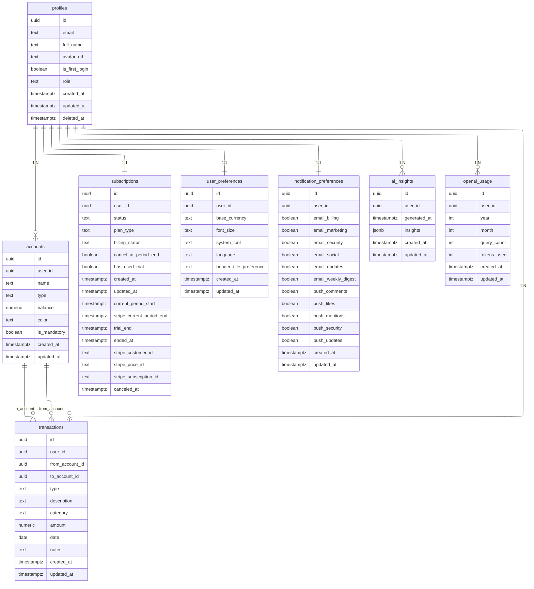

<!-- cSpell:disable -->

# SPIS TREŚCI

## 1. WSTĘP

1.1. Uzasadnienie wyboru tematu  
1.2. Cel pracy  
1.3. Metodologia badawcza  
1.4. Zakres pracy  
1.5. Struktura pracy

## 2. ANALIZA TEORETYCZNA I PRZEGLĄD ROZWIĄZAŃ

2.1. Zarządzanie finansami osobistymi – podstawy  
2.1.1. Kluczowe pojęcia i modele decyzyjne  
2.1.2. Rola automatyzacji i danych w finansach osobistych  
2.1.3. Wyzwania behawioralne użytkowników  
2.2. Modele aplikacji finansowych  
2.2.1. Kategorie funkcjonalne rozwiązań FinTech  
2.2.2. Modele monetyzacji i subskrypcji  
2.2.3. Wymagania regulacyjne dla aplikacji finansowych  
2.3. Technologie webowe w architekturze SaaS  
2.3.1. Charakterystyka architektury Next.js + Supabase  
2.3.2. Integracje w modelu serverless (Vercel, Upstash)  
2.3.3. Standardy bezpieczeństwa (OAuth2, JWT, RLS)  
2.4. Sztuczna inteligencja w FinTech  
2.4.1. Wykorzystanie OpenAI API do analizy i dialogu  
2.4.2. Aspekty etyczne i odpowiedzialne AI  
2.4.3. Personalizacja rekomendacji finansowych  
2.5. Przegląd istniejących platform  
2.5.1. Mint, YNAB, Revolut, PocketGuard – charakterystyka  
2.5.2. Tabela porównawcza funkcjonalności i technologii  
2.5.3. Wnioski benchmarkingowe dla Finwise

## 3. ANALIZA WYMAGAŃ I PROJEKT SYSTEMU

3.1. Grupa docelowa i scenariusze użycia  
3.1.1. Segmentacja użytkowników i personas  
3.1.2. Kluczowe potrzeby i oczekiwane rezultaty  
3.1.3. Priorytetyzacja przypadków użycia  
3.2. Wymagania funkcjonalne  
3.2.1. User stories i przypadki użycia (tabela)  
3.2.2. Zarządzanie kontami, transakcjami i subskrypcją  
3.2.3. Moduły AI, raportowania i eksportu danych  
3.3. Wymagania niefunkcjonalne  
3.3.1. Wydajność, dostępność i skalowalność  
3.3.2. Bezpieczeństwo danych i zgodność z RODO  
3.3.3. Dostępność (WCAG) i doświadczenie użytkownika  
3.4. Architektura systemu  
3.4.1. Diagram architektury i przepływ server actions  
3.4.2. Integracja OpenAI (AI assistant)  
3.4.3. Integracja Stripe (billing i subskrypcje)  
3.4.4. Integracja Supabase i Upstash (autoryzacja, RLS, cache)  
3.5. Projekt bazy danych  
3.5.1. Diagram ERD i kluczowe encje  
3.5.2. Reguły RLS i polityki bezpieczeństwa  
3.5.3. Strategie migracji oraz backupu  
3.6. Modele UX  
3.6.1. Model nawigacji i główne widoki  
3.6.2. Responsywność i prezentacja danych  
3.6.3. Dostępność i współpraca z modułem AI

## 4. IMPLEMENTACJA

4.1. Stack technologiczny  
4.1.1. Next.js, TypeScript, TailwindCSS, shadcn/ui  
4.1.2. Supabase, PostgreSQL, OAuth2, JWT  
4.1.3. Stripe, OpenAI API, Upstash, Vercel, Pino, Sentry  
4.2. Frontend  
4.2.1. Struktura aplikacji i routing (App Router, server actions)  
4.2.2. System komponentów i stylowanie (TailwindCSS, shadcn/ui)  
4.2.3. Mechanizmy personalizacji UI oraz tryby dostępności  
4.3. Backend  
4.3.1. Warstwa usług i integracje Supabase  
4.3.2. Obsługa autoryzacji, RLS i zarządzanie sesją  
4.3.3. Logowanie zdarzeń i monitoring (Pino, Sentry)  
4.4. Integracja płatności Stripe  
4.4.1. Konfiguracja planów i webhooków  
4.4.2. Przepływy billingowe i fakturowanie  
4.4.3. Obsługa reklamacji i zwrotów  
4.5. Moduł sztucznej inteligencji  
4.5.1. Analiza finansów i insighty generowane przez AI  
4.5.2. Chatbot konwersacyjny i zarządzanie kontekstem  
4.5.3. Mechanizmy ograniczania kosztów i rate limiting  
4.6. Eksport danych i personalizacja  
4.6.1. Eksport CSV/PDF oraz integracje zewnętrzne  
4.6.2. Profile użytkownika i preferencje UI

## 5. TESTY I WALIDACJA SYSTEMU

5.1. Strategia testów i narzędzia  
5.1.1. Testy jednostkowe i integracyjne z wykorzystaniem Vitest  
5.1.2. Testy end-to-end z wykorzystaniem Playwright  
5.1.3. Pomiary wydajności jako element strategii testów  
5.2. Testy jednostkowe – logika, walidacja, moduł AI  
5.2.1. Testy funkcji pomocniczych w module utils  
5.2.2. Testy walidacji danych opartej na schematach Zod  
5.2.3. Testy modułu sztucznej inteligencji (AIAssistantService)  
5.3. Testy integracyjne – Stripe, OpenAI, Supabase  
5.3.1. Integracja ze Stripe – obsługa webhooków płatności  
5.3.2. Integracja z OpenAI – wywołania API i obsługa błędów  
5.3.3. Integracja z Supabase – operacje na transakcjach  
5.4. Testy end-to-end – główne scenariusze użytkownika  
5.4.1. Weryfikacja strony głównej  
5.4.2. Logowanie z użyciem magic linku  
5.4.3. Dodawanie transakcji z poziomu dashboardu  
5.4.4. Interakcja z asystentem AI  
5.5. Testy wydajności (Lighthouse) i ograniczenia testowania  
5.5.1. Metodyka pomiarów z użyciem Lighthouse  
5.5.2. Ograniczenia przyjętego podejścia do testowania

## 6. WNIOSKI I KIERUNKI ROZWOJU

6.1. Ocena implementacji  
6.1.1. Stopień realizacji celów i wymagań  
6.1.2. Analiza jakości kodu i utrzymania  
6.1.3. Wnioski dotyczące zastosowanego stacku  
6.2. Analiza ograniczeń  
6.2.1. Ograniczenia technologiczne i integracyjne  
6.2.2. Ograniczenia danych i badań użytkowników  
6.3. Kierunki rozwoju  
6.3.1. Import danych (CSV, open banking)  
6.3.2. Analiza trendów i rekomendacje inwestycyjne  
6.3.3. Aplikacja mobilna  
6.4. Podsumowanie  
6.4.1. Kluczowe rezultaty projektu  
6.4.2. Wkład pracy w rozwój FinTech  
6.4.3. Rekomendacje dla dalszych badań

## 7. BIBLIOGRAFIA

## 8. ZAŁĄCZNIKI

8.1. Materiały projektowe  
8.1.1. Diagram architektury systemu Finwise  
8.1.2. Diagram ERD modelu danych

8.1.3. Zrzuty ekranu interfejsu użytkownika  
8.2. Materiały techniczne  
8.2.1. Raporty z testów (Vitest, Playwright, Lighthouse)  
8.3. Inne materiały  
8.3.1. Link do repozytorium i materiałów uzupełniających
