# Technical Documentation: Finwise Personal Finance Management SaaS

## Abstract

This document provides a comprehensive technical overview of Finwise, a web-based personal finance management Software-as-a-Service (SaaS) application. The system is architected using modern web technologies including Next.js 15, Server Actions, Supabase (PostgreSQL), Stripe for subscription management, Tailwind CSS for styling, and OpenAI API for intelligent financial insights. This documentation serves as a complete reference for understanding the system's architecture, data models, authentication mechanisms, subscription workflows, AI capabilities, security implementations, and future extensibility.

---

## 1. System Overview

### 1.1 Introduction

Finwise is a comprehensive personal finance management platform designed to help users track income, expenses, and financial accounts while providing AI-powered insights and recommendations. The application follows a modern serverless architecture pattern, leveraging Next.js 15's App Router for server-side rendering and React Server Components for optimal performance.

### 1.2 Technology Stack

**Frontend Framework:**

- Next.js 15.5.2 (React 19.1.0)
- TypeScript 5.x
- Tailwind CSS 4.x
- Radix UI + shadcn/ui components
- React Hook Form with Zod validation

**Backend Services:**

- Next.js Server Actions (form submissions, mutations)
- Next.js API Routes (webhooks, external integrations)
- Supabase (PostgreSQL database, authentication)
- Stripe (payment processing, subscription management)
- OpenAI API (GPT-4o-mini for financial insights)

**Infrastructure & Tools:**

- Upstash Redis (rate limiting)
- Vercel (hosting, CDN, edge functions)
- Sentry (error monitoring, performance tracking)
- Pino (structured logging)

**Development Tools:**

- pnpm (package manager)
- ESLint 9 (code linting)
- Prettier (code formatting)
- Husky (git hooks)

### 1.3 Core Capabilities

1. **Financial Transaction Management**: Track income, expenses, and transfers across multiple accounts
2. **Account Management**: Support for checking, savings, investment, and credit card accounts
3. **AI-Powered Insights**: Automated financial analysis and personalized recommendations
4. **Subscription Management**: Tiered subscription plans with Stripe integration
5. **User Authentication**: Secure authentication via Supabase Auth (email/password, magic links, OAuth)
6. **Data Visualization**: Interactive charts and dashboards for financial trends
7. **Multi-tenant Architecture**: Row-level security ensuring data isolation

---

## 2. High-Level Architecture

### 2.1 System Architecture Diagram

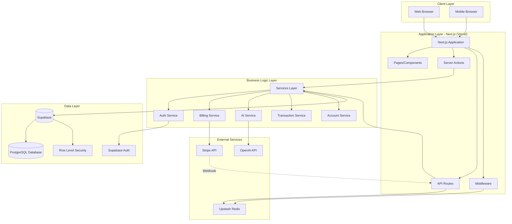

### 2.2 Architecture Patterns

**Layered Architecture:**

- **Presentation Layer**: React components, pages, UI elements
- **Routing Layer**: Next.js App Router, middleware, route protection
- **Business Logic Layer**: Service classes encapsulating domain logic
- **Data Access Layer**: Supabase client, database queries, RLS policies
- **Data Layer**: PostgreSQL database with triggers and functions

**Design Patterns:**

- **Server Actions Pattern**: Form submissions and mutations via Next.js Server Actions
- **Repository Pattern**: Data access abstraction through Supabase client
- **Service Layer Pattern**: Business logic separated from HTTP concerns
- **Dependency Injection**: Services receive dependencies via constructor
- **Middleware Pattern**: Route protection and authentication checks

**Security Patterns:**

- **Defense in Depth**: Multiple security layers (client, network, application, database)
- **Row Level Security (RLS)**: Database-level access control
- **JWT-based Authentication**: Stateless authentication with refresh tokens
- **Rate Limiting**: Protection against abuse and brute force attacks

---

## 3. Functional Requirements

### 3.1 User Management

**FR-1: User Registration**

- Users can register with email and password
- Password must meet strength requirements (8+ chars, uppercase, lowercase, number, special character)
- Automatic profile creation upon registration
- Email verification support (optional)
- Rate limiting: 5 attempts per 15 minutes

**FR-2: User Authentication**

- Email/password authentication
- Magic link authentication (passwordless)
- OAuth authentication (GitHub, Google)
- Session management with JWT tokens
- Automatic token refresh
- First login detection

**FR-3: User Profile Management**

- Update profile information (full name, avatar)
- View subscription status
- Manage user preferences (theme, language, font size)
- Notification preferences management

### 3.2 Financial Account Management

**FR-4: Account Creation and Management**

- Create multiple accounts (checking, savings, investment, credit card)
- Set account names, types, and colors
- View account balances
- Automatic "Main Account" creation for new users
- Account deletion with cascade to transactions

**FR-5: Transaction Management**

- Create income transactions
- Create expense transactions
- Create transfer transactions between accounts
- Categorize transactions
- Add notes and descriptions
- View transaction history with filtering
- Edit and delete transactions
- Automatic balance updates

### 3.3 Financial Analytics

**FR-6: Dashboard and Reporting**

- Monthly income and expense summaries
- Category-based spending analysis
- Spending trends over time
- Account balance history
- Financial health score calculation
- Interactive charts and visualizations

**FR-7: Data Export**

- Export transactions to CSV
- Export transactions to Excel
- Filtered export by date range, category, account

### 3.4 AI-Powered Features

**FR-8: Financial Insights Generation**

- Automated monthly financial insights
- Spending pattern analysis
- Savings recommendations
- Budget optimization suggestions
- Areas of concern identification
- Usage tracking and limits

**FR-9: AI Financial Assistant**

- Natural language questions about finances
- Context-aware responses based on transaction data
- Suggested follow-up questions
- Related transaction and account data display
- Token usage tracking and rate limiting

### 3.5 Subscription Management

**FR-10: Subscription Plans**

- Free tier with basic features
- Paid tiers (Basic, Pro) with enhanced features
- Plan comparison and selection
- Trial period support
- Subscription status tracking

**FR-11: Payment Processing**

- Stripe Checkout integration
- Secure payment collection
- Invoice generation and management
- Customer portal access
- Payment method management

**FR-12: Subscription Lifecycle**

- Subscription creation
- Plan upgrades and downgrades
- Subscription cancellation
- Automatic renewal
- Trial period management

---

## 4. Non-Functional Requirements

### 4.1 Performance Requirements

**NFR-1: Response Time**

- Page load time: < 2 seconds (first contentful paint)
- API response time: < 500ms (p95)
- Database query time: < 200ms (p95)
- AI insight generation: < 5 seconds

**NFR-2: Scalability**

- Support for 10,000+ concurrent users
- Horizontal scaling via serverless functions
- Database connection pooling (Supabase Supavisor)
- CDN caching for static assets
- Edge function deployment for low latency

**NFR-3: Throughput**

- 1,000 requests per second per instance
- Database: 1,000 queries per second
- Rate limiting: 100 API requests per hour per user

### 4.2 Security Requirements

**NFR-4: Authentication and Authorization**

- JWT token expiration: 1 hour (access), 7 days (refresh)
- HTTPS enforcement in production
- Secure cookie flags (HttpOnly, Secure, SameSite)
- Row-level security on all user data tables
- OAuth 2.0 compliance for third-party authentication

**NFR-5: Data Protection**

- Encryption at rest (Supabase managed)
- Encryption in transit (TLS 1.2+)
- Password hashing (bcrypt via Supabase)
- PII data protection (GDPR compliance)
- Regular security audits

**NFR-6: Input Validation**

- Server-side validation for all inputs
- SQL injection prevention (parameterized queries)
- XSS prevention (input sanitization)
- CSRF protection (SameSite cookies, tokens)

### 4.3 Reliability Requirements

**NFR-7: Availability**

- 99.9% uptime target
- Automatic failover for database
- Redundant API endpoints
- Health check monitoring

**NFR-8: Error Handling**

- Graceful error degradation
- User-friendly error messages
- Comprehensive error logging
- Error monitoring (Sentry integration)

**NFR-9: Data Integrity**

- Transaction atomicity (database transactions)
- Foreign key constraints
- Data validation at multiple layers
- Backup and recovery procedures

### 4.4 Usability Requirements

**NFR-10: User Interface**

- Responsive design (mobile, tablet, desktop)
- Dark/light theme support
- Accessibility (WCAG 2.1 AA compliance)
- Intuitive navigation
- Loading states and skeletons

**NFR-11: Internationalization**

- Multi-language support (English default)
- Date and currency formatting
- Timezone handling

### 4.5 Maintainability Requirements

**NFR-12: Code Quality**

- TypeScript strict mode
- ESLint configuration
- Prettier code formatting
- Comprehensive documentation
- Test coverage (target: 80%+)

**NFR-13: Monitoring and Logging**

- Structured logging (Pino)
- Error tracking (Sentry)
- Performance monitoring
- Usage analytics
- Audit trails

---

## 5. API Structure and Flow

### 5.1 API Architecture

The application uses a hybrid API approach:

1. **Server Actions**: Primary mechanism for form submissions and mutations
2. **API Routes**: Used for webhooks and external service integrations
3. **Supabase Client**: Direct database access with RLS enforcement

### 5.2 Server Actions

Server Actions are Next.js functions marked with `'use server'` that execute on the server. They handle:

**Authentication Actions** (`src/lib/actions/auth-actions.ts`):

- `signUpWithEmail(formData)` - User registration
- `signInWithEmail(formData)` - Email/password login
- `signInWithMagicLink(formData)` - Magic link authentication
- `signInWithOAuth(provider)` - OAuth login
- `signOut()` - User logout
- `updateProfile(formData)` - Profile updates
- `forgotPassword(formData)` - Password reset request
- `resetPassword(formData)` - Password reset confirmation

**Billing Actions** (`src/lib/actions/billing-actions.ts`):

- `createCheckoutSessionAction(planType)` - Create Stripe checkout
- `createCustomerPortalAction()` - Access customer portal
- `getUserSubscription(userId)` - Get subscription details
- `getInvoices(userId)` - Retrieve invoices

**Flow Example - User Registration:**

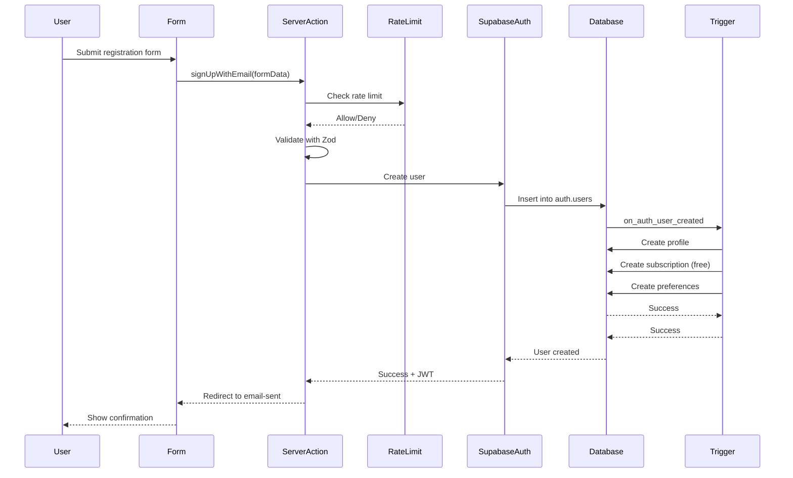

### 5.3 API Routes

API routes are located in `src/app/api/` and handle external service integrations:

**Stripe Webhook** (`/api/stripe/webhook`):

- Handles Stripe subscription events
- Verifies webhook signatures
- Updates subscription status in database
- Processes payment events

**Webhook Flow:**

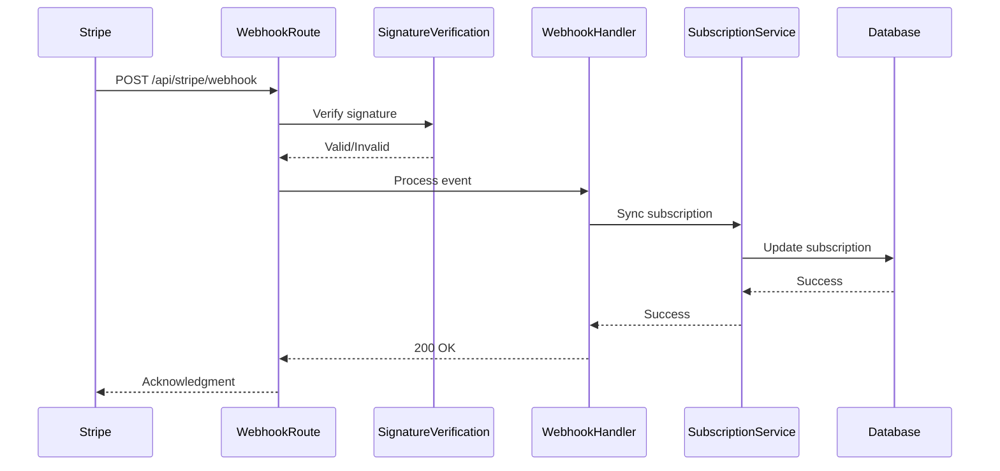

### 5.4 Request Flow with Rate Limiting

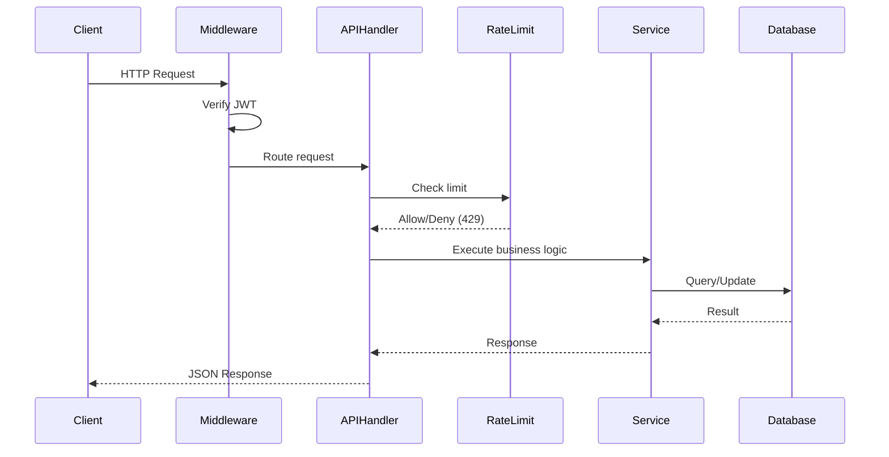

### 5.5 Service Layer Architecture

Services encapsulate business logic and are called by Server Actions and API Routes:

**Service Classes:**

- `AuthService`: Authentication and user management
- `BillingService`: Stripe integration and payment processing
- `AIService`: OpenAI integration and financial insights
- `TransactionService`: Transaction CRUD and analytics
- `AccountService`: Account management
- `SubscriptionService`: Subscription lifecycle management
- `UserService`: User profile management
- `NotificationService`: Notification preferences

**Service Pattern:**

```typescript
export class TransactionService {
  constructor(private readonly supabase: SupabaseClient<Database>) {}

  async createTransaction(
    userId: string,
    data: CreateTransactionInput,
  ): Promise<ServiceResult<Transaction>> {
    // 1. Validate input
    // 2. Execute business logic
    // 3. Update database
    // 4. Return result
  }
}
```

---

## 6. Data Model (ERD)

### 6.1 Entity Relationship Diagram

```mermaid
erDiagram
    auth_users ||--|| profiles : "1:1"
    profiles ||--|| subscriptions : "1:1"
    profiles ||--|| user_preferences : "1:1"
    profiles ||--|| notification_preferences : "1:1"
    profiles ||--o{ accounts : "1:N"
    profiles ||--o{ transactions : "1:N"
    profiles ||--o{ ai_insights : "1:N"
    profiles ||--o{ openai_usage : "1:N"
    accounts ||--o{ transactions : "from_account"
    accounts ||--o{ transactions : "to_account"

    auth_users {
        uuid id PK
        text email
        timestamp created_at
        jsonb raw_user_meta_data
    }

    profiles {
        uuid id PK,FK
        text email UK
        text full_name
        text avatar_url
        user_role role
        boolean is_first_login
        timestamp created_at
        timestamp updated_at
        timestamp deleted_at
    }

    subscriptions {
        uuid id PK
        uuid user_id FK
        text stripe_customer_id UK
        text stripe_subscription_id UK
        text stripe_price_id
        text plan_type
        subscription_status status
        timestamp current_period_start
        timestamp stripe_current_period_end
        boolean cancel_at_period_end
        timestamp trial_end
        boolean has_used_trial
        timestamp created_at
        timestamp updated_at
    }

    accounts {
        uuid id PK
        uuid user_id FK
        text name
        account_type type
        numeric balance
        text color
        boolean is_mandatory
        timestamp created_at
        timestamp updated_at
    }

    transactions {
        uuid id PK
        uuid user_id FK
        uuid from_account_id FK
        uuid to_account_id FK
        transaction_type type
        text description
        text category
        numeric amount
        date date
        text notes
        timestamp created_at
        timestamp updated_at
    }

    user_preferences {
        uuid id PK
        uuid user_id FK
        text theme
        text language
        text system_font
        text font_size
        timestamp created_at
        timestamp updated_at
    }

    notification_preferences {
        uuid id PK
        uuid user_id FK
        boolean email_marketing
        boolean email_security
        boolean email_billing
        boolean push_security
        timestamp created_at
        timestamp updated_at
    }

    ai_insights {
        uuid id PK
        uuid user_id FK
        jsonb insights
        timestamp generated_at
    }

    openai_usage {
        uuid id PK
        uuid user_id FK
        integer year
        integer month
        integer query_count
        integer tokens_used
        timestamp created_at
        timestamp updated_at
    }
```

### 6.2 Core Tables

#### 6.2.1 profiles

Stores user profile information linked to Supabase Auth users.

**Key Fields:**

- `id` (UUID, PK, FK to auth.users.id)
- `email` (TEXT, UNIQUE)
- `full_name` (TEXT, nullable)
- `role` (user_role enum: 'user', 'admin')
- `is_first_login` (BOOLEAN, default: true)

**Relationships:**

- One-to-one with `auth.users`
- One-to-one with `subscriptions`
- One-to-many with `accounts`
- One-to-many with `transactions`

#### 6.2.2 subscriptions

Manages user subscription and billing information.

**Key Fields:**

- `user_id` (UUID, FK, UNIQUE)
- `stripe_customer_id` (TEXT, UNIQUE)
- `stripe_subscription_id` (TEXT, UNIQUE)
- `plan_type` (TEXT: 'free', 'basic', 'pro')
- `status` (subscription_status enum)
- `trial_end` (TIMESTAMPTZ, nullable)
- `has_used_trial` (BOOLEAN)

**Status Values:**

- `active`: Subscription is active and paid
- `canceled`: Subscription has been canceled
- `trialing`: In trial period
- `past_due`: Payment failed
- `unpaid`: Payment required
- `incomplete`: Setup incomplete

#### 6.2.3 accounts

Financial accounts (checking, savings, investment, credit card).

**Key Fields:**

- `user_id` (UUID, FK)
- `name` (TEXT)
- `type` (account_type enum)
- `balance` (NUMERIC(12,2), default: 0)
- `color` (TEXT, nullable)
- `is_mandatory` (BOOLEAN, default: false)

**Account Types:**

- `checking`: Checking account
- `savings`: Savings account
- `investment`: Investment account
- `creditcard`: Credit card account

#### 6.2.4 transactions

Financial transactions (income, expense, transfer).

**Key Fields:**

- `user_id` (UUID, FK)
- `from_account_id` (UUID, FK, nullable)
- `to_account_id` (UUID, FK, nullable)
- `type` (transaction_type enum)
- `description` (TEXT)
- `category` (TEXT)
- `amount` (NUMERIC(12,2), > 0)
- `date` (DATE)

**Transaction Types:**

- `income`: Money received (to_account_id required)
- `expense`: Money spent (from_account_id required)
- `transfer`: Money moved between accounts (both IDs required)

**Constraints:**

- Income: `from_account_id IS NULL AND to_account_id IS NOT NULL`
- Expense: `from_account_id IS NOT NULL AND to_account_id IS NULL`
- Transfer: `from_account_id IS NOT NULL AND to_account_id IS NOT NULL AND from_account_id <> to_account_id`

#### 6.2.5 ai_insights

Stores AI-generated financial insights.

**Key Fields:**

- `user_id` (UUID, FK)
- `insights` (JSONB): Structured insights data
- `generated_at` (TIMESTAMPTZ)

**Insights Structure:**

```json
{
  "spendingInsights": ["insight1", "insight2", ...],
  "savingsTips": ["tip1", "tip2", ...],
  "budgetOptimization": ["suggestion1", ...],
  "areasOfConcern": ["concern1", ...]
}
```

#### 6.2.6 openai_usage

Tracks OpenAI API usage per user per month.

**Key Fields:**

- `user_id` (UUID, FK)
- `year` (INTEGER)
- `month` (INTEGER)
- `query_count` (INTEGER, default: 0)
- `tokens_used` (INTEGER, default: 0)

**Purpose:**

- Monitor API usage
- Enforce rate limits
- Cost tracking

### 6.3 Database Functions and Triggers

#### 6.3.1 handle_new_user()

Automatically creates related records when a user signs up:

```sql
CREATE OR REPLACE FUNCTION public.handle_new_user()
RETURNS TRIGGER AS $$
BEGIN
  -- Create profile
  INSERT INTO public.profiles (id, email, full_name, avatar_url)
  VALUES (NEW.id, NEW.email, ...);

  -- Create subscription (free tier)
  INSERT INTO public.subscriptions (user_id, plan_type, status)
  VALUES (NEW.id, 'free', 'active');

  -- Create preferences
  INSERT INTO public.user_preferences (user_id) VALUES (NEW.id);
  INSERT INTO public.notification_preferences (user_id) VALUES (NEW.id);

  -- Create mandatory "Main Account"
  INSERT INTO public.accounts (user_id, name, type, balance, is_mandatory)
  VALUES (NEW.id, 'Main Account', 'checking', 0, true);

  RETURN NEW;
END;
$$ LANGUAGE plpgsql SECURITY DEFINER;
```

#### 6.3.2 update_updated_at_column()

Automatically updates `updated_at` timestamp on row updates.

### 6.4 Indexes

**Performance Indexes:**

- `idx_profiles_email`: Fast email lookups
- `idx_transactions_user_date`: Efficient date-range queries
- `idx_transactions_user_type_date`: Composite index for common queries
- `idx_subscriptions_user_id`: Fast subscription lookups
- `idx_accounts_user_id`: Fast account queries

---

## 7. Authentication and Authorization

### 7.1 Authentication Architecture

Finwise uses **Supabase Auth** for authentication, providing:

- JWT-based stateless authentication
- Multiple authentication methods
- Automatic session management
- Secure password hashing (bcrypt)
- Email verification support

### 7.2 Authentication Methods

#### 7.2.1 Email/Password Authentication

**Registration Flow:**

1. User submits email and password
2. Server Action validates input (Zod schema)
3. Rate limiting check (5 attempts per 15 minutes)
4. Supabase Auth creates user account
5. Database trigger creates profile and related records
6. Verification email sent (if enabled)
7. User redirected to email-sent page

**Login Flow:**

1. User submits credentials
2. Rate limiting check
3. Supabase Auth verifies credentials
4. JWT access token (1 hour) and refresh token (7 days) generated
5. Tokens stored in HTTP-only cookies
6. Middleware validates tokens on subsequent requests
7. Automatic token refresh when expired

#### 7.2.2 Magic Link Authentication

Passwordless authentication via email:

1. User enters email address
2. Supabase sends magic link to email
3. User clicks link
4. Automatic authentication and redirect
5. Profile created if first-time user

**Benefits:**

- No password to remember
- Reduced password reset requests
- Built-in email verification

#### 7.2.3 OAuth Authentication

Supported providers: GitHub, Google

**Flow:**

1. User clicks "Sign in with [Provider]"
2. Redirected to provider's authorization page
3. User authorizes application
4. Provider redirects back with authorization code
5. Supabase exchanges code for tokens
6. User authenticated with profile created

**Configuration:**

- OAuth apps created in provider dashboards
- Redirect URLs configured in Supabase
- Client IDs and secrets stored in Supabase

### 7.3 JWT Token Management

**Token Structure:**

- **Access Token**: Short-lived (1 hour), contains user ID and claims
- **Refresh Token**: Long-lived (7 days), used to obtain new access tokens

**Token Storage:**

- HTTP-only cookies (prevents XSS)
- Secure flag (HTTPS only in production)
- SameSite=Strict (CSRF protection)

**Token Refresh Flow:**

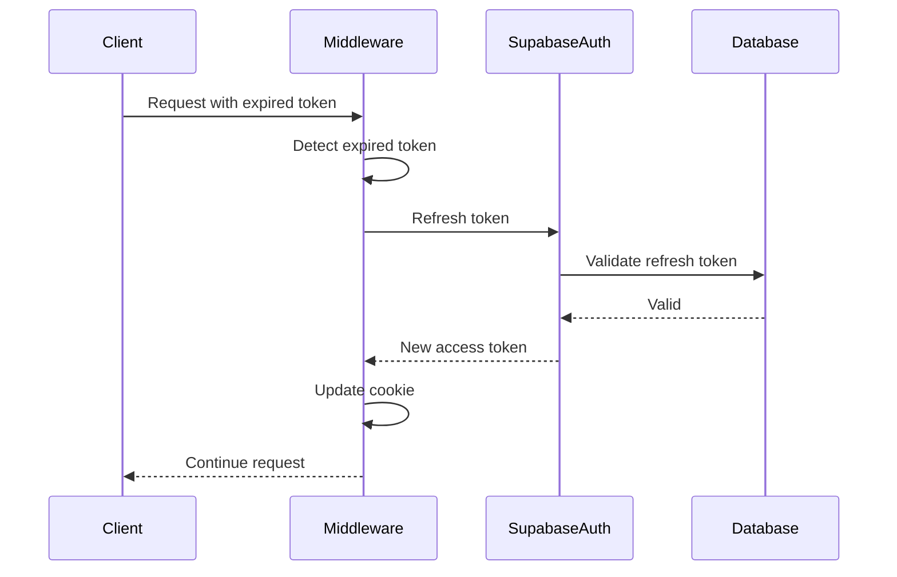

### 7.4 Authorization: Row Level Security (RLS)

All user data tables have RLS enabled with policies ensuring users can only access their own data.

**Example Policy (profiles):**

```sql
CREATE POLICY "Users can view own profile" ON profiles
  FOR SELECT USING (auth.uid() = id);

CREATE POLICY "Users can update own profile" ON profiles
  FOR UPDATE USING (auth.uid() = id);
```

**RLS Enforcement:**

- Automatic at database level
- No application code needed
- Prevents data leakage
- Works with Supabase client automatically

**Service Role Client:**

- Used for webhooks and admin operations
- Bypasses RLS (use with caution)
- Requires `SUPABASE_SERVICE_ROLE_KEY`

### 7.5 Middleware Protection

Next.js middleware protects routes:

```typescript
export async function middleware(request: NextRequest) {
  const supabase = await createClientForServer();
  const {
    data: { user },
  } = await supabase.auth.getUser();

  // Protected routes require authentication
  if (isProtectedRoute(request.nextUrl.pathname) && !user) {
    return NextResponse.redirect('/login');
  }

  // Auth routes redirect if already authenticated
  if (isAuthRoute(request.nextUrl.pathname) && user) {
    return NextResponse.redirect('/dashboard');
  }
}
```

**Protected Routes:**

- `/dashboard/*`
- `/settings/*`
- `/accounts/*`
- `/transactions/*`

**Public Routes:**

- `/login`
- `/signup`
- `/pricing`
- `/about`

---

## 8. Subscription Workflow (Stripe)

### 8.1 Subscription Architecture

Finwise integrates with Stripe for subscription management:

- **Stripe Checkout**: Secure payment collection
- **Stripe Customer Portal**: Self-service subscription management
- **Webhooks**: Real-time subscription event processing
- **Subscription Sync**: Database synchronization with Stripe

### 8.2 Subscription Plans

**Free Tier:**

- Basic transaction tracking
- Limited AI queries (10 per month)
- Basic analytics

**Basic Plan:**

- All free features
- Unlimited transactions
- 50 AI queries per month
- Advanced analytics

**Pro Plan:**

- All basic features
- Unlimited AI queries
- Priority support
- Export features

### 8.3 Subscription Creation Flow

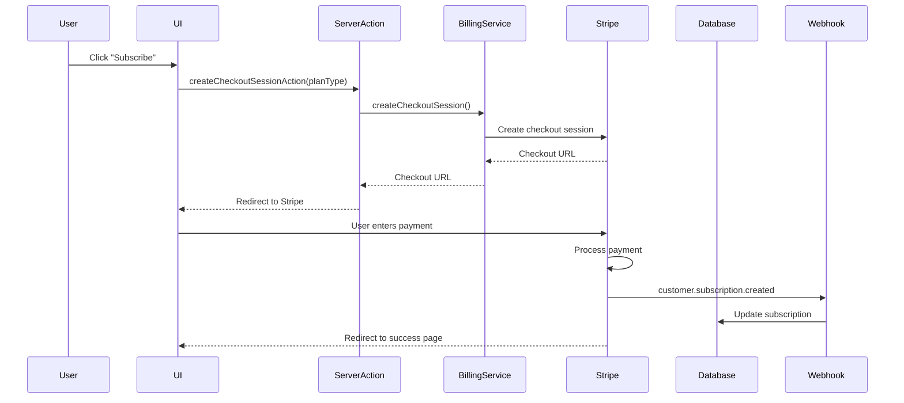

### 8.4 Stripe Webhook Processing

**Webhook Endpoint:** `/api/stripe/webhook`

**Security:**

- Signature verification using `STRIPE_WEBHOOK_SECRET`
- Idempotency handling
- Error logging and retry logic

**Handled Events:**

1. **customer.subscription.created**
   - New subscription activated
   - Sync subscription to database
   - Update plan type and status

2. **customer.subscription.updated**
   - Plan changes, status updates
   - Sync all subscription fields
   - Update billing period

3. **customer.subscription.deleted**
   - Subscription canceled
   - Set status to 'canceled'
   - Preserve historical data

4. **invoice.payment_succeeded**
   - Payment processed successfully
   - Log for audit
   - Send confirmation (optional)

5. **invoice.payment_failed**
   - Payment failed
   - Update subscription status
   - Send notification (optional)

**Webhook Handler Implementation:**

```typescript
export async function handleWebhookEvent(event: Stripe.Event) {
  switch (event.type) {
    case 'customer.subscription.created':
    case 'customer.subscription.updated':
      const subscription = event.data.object as Stripe.Subscription;
      await syncSubscriptionToDatabase(subscription);
      break;

    case 'customer.subscription.deleted':
      await deleteSubscriptionFromDatabase(event.data.object.id);
      break;

    // ... other events
  }
}
```

### 8.5 Subscription Status Management

**Status Flow:**

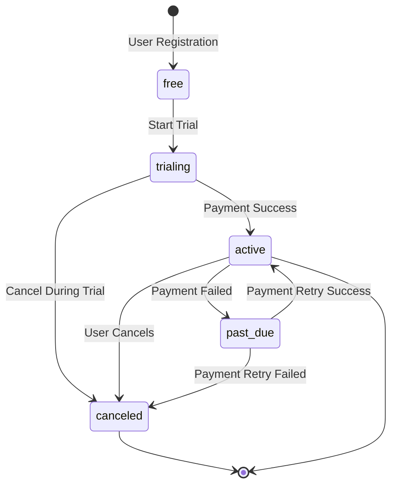

**Status Mapping:**

- Stripe status → Database status
- `active` → `active`
- `trialing` → `trialing`
- `past_due` → `past_due`
- `canceled` → `canceled`
- `unpaid` → `unpaid`

### 8.6 Customer Portal Integration

Users can manage subscriptions via Stripe Customer Portal:

1. User clicks "Manage Subscription"
2. Server Action creates portal session
3. Stripe generates portal URL
4. User redirected to Stripe portal
5. User can update payment method, cancel, resume
6. Changes sync via webhooks

---

## 9. AI Features Scope

### 9.1 AI Architecture

Finwise integrates OpenAI's GPT-4o-mini model for financial insights and assistance.

**Components:**

- `AIService`: Main service for AI operations
- `OpenAIUsageService`: Usage tracking and rate limiting
- `callOpenAI()`: OpenAI API client wrapper

### 9.2 Financial Insights Generation

**Process:**

1. **Data Aggregation:**
   - Monthly summary (income, expenses, savings)
   - Category spending breakdown
   - Spending trends (30 days)
   - Account balances

2. **AI Analysis:**
   - Structured prompt with financial context
   - JSON response parsing
   - Fallback to rule-based insights if AI fails

3. **Insight Categories:**
   - **Spending Insights**: Pattern analysis, unusual spending
   - **Savings Tips**: Actionable savings recommendations
   - **Budget Optimization**: Budget improvement suggestions
   - **Areas of Concern**: Financial health warnings

**Example Prompt:**

```
Analyze the following financial data:
- Total Income: $5,000
- Total Expenses: $4,200
- Top Category: Food (30%)
...

Provide insights in JSON format:
{
  "spendingInsights": [...],
  "savingsTips": [...],
  "budgetOptimization": [...],
  "areasOfConcern": [...]
}
```

### 9.3 AI Financial Assistant

**Capabilities:**

- Natural language questions about finances
- Context-aware responses using transaction data
- Suggested follow-up questions
- Related data display (transactions, accounts)

**Question Processing Flow:**

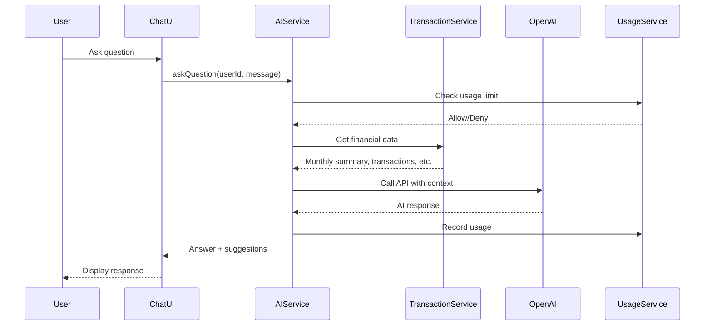

**Context Provided to AI:**

- Monthly income/expense summary
- Top spending categories
- Recent transactions
- Account balances
- Spending trends
- Financial metrics (savings rate, averages)

### 9.4 Usage Tracking and Limits

**Tracking:**

- Per-user, per-month usage tracking
- Query count and token usage
- Stored in `openai_usage` table

**Rate Limits:**

- Free tier: 10 queries/month
- Basic tier: 50 queries/month
- Pro tier: Unlimited queries

**Implementation:**

```typescript
async canMakeAPICall(userId: string): Promise<ServiceResult<boolean>> {
  const subscription = await this.getUserSubscription(userId);
  const usage = await this.getCurrentMonthUsage(userId);

  if (subscription.planType === 'free' && usage.queryCount >= 10) {
    return { success: true, data: false };
  }

  if (subscription.planType === 'basic' && usage.queryCount >= 50) {
    return { success: true, data: false };
  }

  return { success: true, data: true };
}
```

### 9.5 Fallback Mechanisms

**Rule-Based Insights:**

- If OpenAI is unavailable or fails
- Predefined rules and patterns
- Basic financial analysis
- Ensures service availability

**Mock Responses:**

- For questions when OpenAI unavailable
- Pattern matching on keywords
- Basic contextual responses
- Maintains user experience

---

## 10. Security Considerations

### 10.1 Security Architecture

Finwise implements a **defense-in-depth** security model with multiple layers:

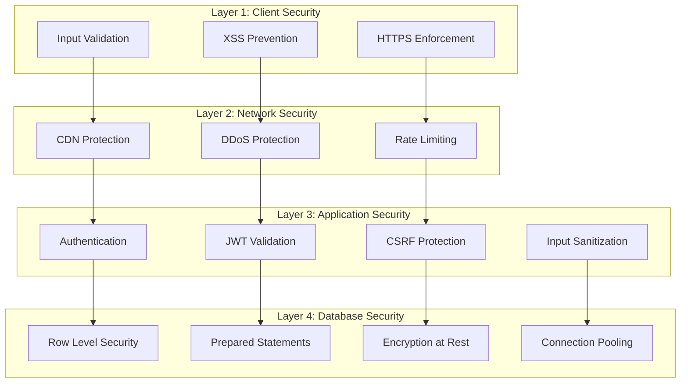

### 10.2 Authentication Security

**Password Requirements:**

- Minimum 8 characters
- At least one uppercase letter
- At least one lowercase letter
- At least one number
- At least one special character

**Session Security:**

- JWT tokens with short expiration (1 hour)
- Refresh tokens with longer expiration (7 days)
- HTTP-only cookies (XSS prevention)
- Secure flag (HTTPS only)
- SameSite=Strict (CSRF prevention)

**Rate Limiting:**

- Authentication: 5 attempts per 15 minutes
- API routes: 100 requests per hour
- Sliding window algorithm
- IP-based and user-based tracking

### 10.3 Data Protection

**Encryption:**

- **At Rest**: Supabase managed encryption
- **In Transit**: TLS 1.2+ for all connections
- **Passwords**: bcrypt hashing (Supabase)

**Data Isolation:**

- Row Level Security (RLS) on all tables
- Users can only access their own data
- Service role client only for webhooks
- Foreign key constraints ensure data integrity

**PII Protection:**

- GDPR compliance considerations
- Data export functionality
- Account deletion with cascade
- Audit logging for sensitive operations

### 10.4 Input Validation and Sanitization

**Validation Layers:**

1. **Client-side**: React Hook Form + Zod
2. **Server-side**: Zod schema validation
3. **Database**: Constraints and types

**SQL Injection Prevention:**

- Parameterized queries (Supabase client)
- No raw SQL string concatenation
- Type-safe database operations

**XSS Prevention:**

- Input sanitization
- React's automatic escaping
- Content Security Policy (CSP) headers

### 10.5 API Security

**Stripe Webhook Security:**

- Signature verification using webhook secret
- Idempotency handling
- Error logging and monitoring

**API Route Security:**

- Authentication checks
- Rate limiting
- Input validation
- Error handling without information leakage

### 10.6 Security Headers

Recommended headers (via Next.js config):

```typescript
{
  'X-Frame-Options': 'DENY',
  'X-Content-Type-Options': 'nosniff',
  'Referrer-Policy': 'strict-origin-when-cross-origin',
  'Permissions-Policy': 'camera=(), microphone=(), geolocation=()',
  'Content-Security-Policy': "default-src 'self'; ..."
}
```

### 10.7 Security Best Practices

**Code Security:**

- TypeScript strict mode
- Regular dependency updates
- Security audits (`pnpm audit`)
- No hardcoded secrets
- Environment variable validation

**Monitoring:**

- Error tracking (Sentry)
- Security event logging
- Suspicious activity alerts
- Regular security reviews

---

## 11. Future Extensions Roadmap

### 11.1 Short-Term Enhancements (3-6 months)

**11.1.1 Enhanced AI Features**

- Multi-turn conversation support
- Financial goal setting with AI recommendations
- Predictive spending analysis
- Automated categorization improvements

**11.1.2 Mobile Application**

- Native iOS application
- Native Android application
- Push notifications
- Offline mode support

**11.1.3 Bank Integration**

- Plaid integration for automatic transaction import
- Bank account linking
- Real-time balance synchronization
- Transaction categorization automation

**11.1.4 Advanced Analytics**

- Custom report generation
- Budget templates
- Financial forecasting
- Investment tracking

### 11.2 Medium-Term Enhancements (6-12 months)

**11.2.1 Multi-Currency Support**

- Multiple currency accounts
- Currency conversion
- Exchange rate tracking
- Multi-currency reporting

**11.2.2 Collaboration Features**

- Shared accounts (family, business)
- Expense splitting
- Shared budgets
- Permission management

**11.2.3 Recurring Transactions**

- Subscription tracking
- Bill reminders
- Automatic transaction creation
- Recurring payment management

**11.2.4 Advanced Budgeting**

- Envelope budgeting
- Zero-based budgeting
- Budget alerts and notifications
- Budget vs. actual reporting

### 11.3 Long-Term Enhancements (12+ months)

**11.3.1 Investment Portfolio Management**

- Investment account tracking
- Portfolio performance analysis
- Asset allocation recommendations
- Tax-loss harvesting suggestions

**11.3.2 Tax Preparation**

- Tax category tagging
- Tax report generation
- Integration with tax software
- Deduction recommendations

**11.3.3 Financial Planning Tools**

- Retirement planning calculator
- Debt payoff calculator
- Savings goal tracking
- Financial health score improvements

**11.3.4 Marketplace Integration**

- Third-party app integrations
- Financial service marketplace
- API for developers
- Webhook support for external services

### 11.4 Technical Improvements

**11.4.1 Performance Optimization**

- Database query optimization
- Caching layer (Redis)
- CDN for static assets
- GraphQL API (optional)

**11.4.2 Scalability**

- Database read replicas
- Microservices architecture (if needed)
- Event-driven architecture
- Message queue for async operations

**11.4.3 Developer Experience**

- Comprehensive test suite
- API documentation (OpenAPI/Swagger)
- Developer SDK
- Integration examples

**11.4.4 Compliance and Regulations**

- SOC 2 compliance
- PCI DSS compliance (if handling card data directly)
- Regional data residency
- Enhanced GDPR features

### 11.5 Architecture Evolution

**Current Architecture:**

- Monolithic Next.js application
- Supabase for database and auth
- Server Actions for mutations

**Potential Future Architecture:**

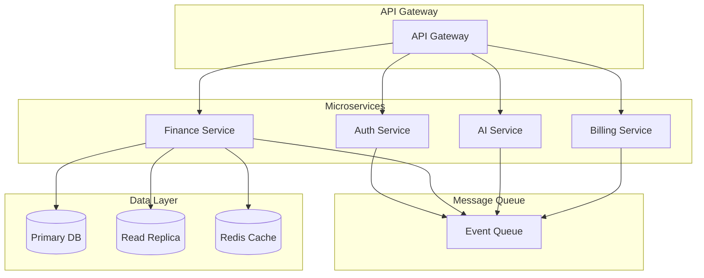

**Migration Considerations:**

- Gradual migration strategy
- Backward compatibility
- Zero-downtime deployment
- Feature flags for gradual rollout

---

## 12. Conclusion

Finwise represents a modern, scalable architecture for personal finance management, leveraging cutting-edge technologies and best practices. The system's design emphasizes:

1. **Security**: Multi-layered security with RLS, rate limiting, and encryption
2. **Scalability**: Serverless architecture enabling horizontal scaling
3. **Maintainability**: Clean code structure with service layer separation
4. **User Experience**: Fast, responsive interface with AI-powered insights
5. **Extensibility**: Well-structured codebase ready for future enhancements

The architecture supports current requirements while providing a foundation for future growth and feature expansion. The use of established patterns and technologies ensures long-term maintainability and developer productivity.

---

## Appendix A: Technology Versions

- Next.js: 15.5.2
- React: 19.1.0
- TypeScript: 5.x
- Supabase: Latest (via @supabase/supabase-js 2.57.4)
- Stripe: 18.5.0
- OpenAI: 6.8.1 (GPT-4o-mini)
- Tailwind CSS: 4.x
- Node.js: 18.17+

## Appendix B: Key Environment Variables

```bash
# Supabase
NEXT_PUBLIC_SUPABASE_URL=
NEXT_PUBLIC_SUPABASE_ANON_KEY=
SUPABASE_SERVICE_ROLE_KEY=

# Stripe
STRIPE_SECRET_KEY=
STRIPE_WEBHOOK_SECRET=
NEXT_PUBLIC_STRIPE_PUBLISHABLE_KEY=

# OpenAI
OPENAI_API_KEY=
OPENAI_MODEL=gpt-4o-mini

# Upstash Redis
UPSTASH_REDIS_REST_URL=
UPSTASH_REDIS_REST_TOKEN=

# Application
NEXT_PUBLIC_APP_URL=
CSRF_SECRET=
```

## Appendix C: Database Schema Summary

**Core Tables:**

- `profiles`: User profiles
- `subscriptions`: Subscription management
- `accounts`: Financial accounts
- `transactions`: Financial transactions
- `user_preferences`: UI preferences
- `notification_preferences`: Notification settings
- `ai_insights`: AI-generated insights
- `openai_usage`: API usage tracking

**Enums:**

- `account_type`: checking, savings, investment, creditcard
- `transaction_type`: income, expense, transfer
- `subscription_status`: active, canceled, trialing, past_due, unpaid, incomplete
- `user_role`: user, admin

---

**Document Version:** 1.0  
**Last Updated:** January 2025  
**Author:** Finwise Development Team
