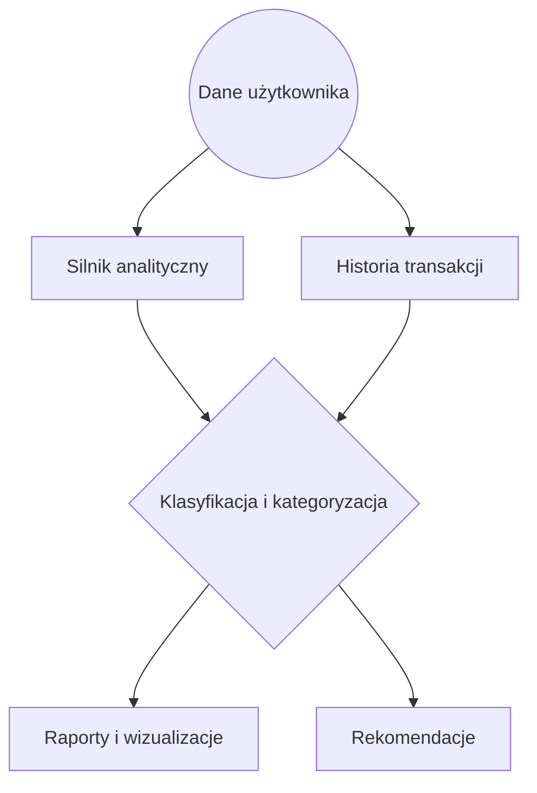
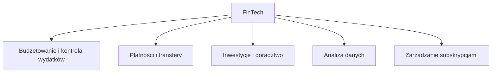
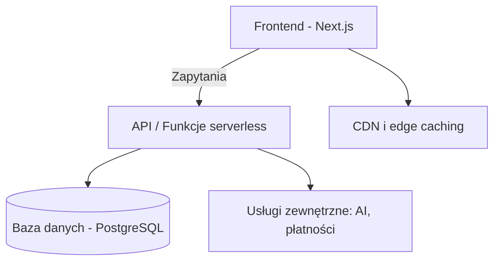

<!-- cSpell:disable -->

# 2. ANALIZA TEORETYCZNA I PRZEGLĄD ROZWIĄZAŃ

Rozdział drugi stanowi fundament teoretyczny pracy i ma na celu przedstawienie koncepcji związanych z zarządzaniem finansami osobistymi, współczesnymi modelami aplikacji finansowych oraz technologicznymi podstawami systemów typu SaaS. Omawiane treści tworzą kontekst dla późniejszej części projektowo-implementacyjnej, a jednocześnie pozwalają zrozumieć, w jaki sposób rozwiązania stosowane w branży FinTech wpisują się w szersze zjawiska ekonomiczne, technologiczne i społeczne.

## 2.1. Zarządzanie finansami osobistymi – podstawy

W pierwszej części rozdziału omówiono podstawy zarządzania finansami osobistymi, skupiając się na najważniejszych pojęciach, modelach decyzyjnych oraz roli danych i automatyzacji w procesie analizy danych finansowych. Szczególną uwagę poświęcono również aspektom psychologicznym i behawioralnym, które często determinują sposób, w jaki użytkownicy korzystają z narzędzi finansowych.

### 2.1.1. Kluczowe pojęcia i modele decyzyjne

Zarządzanie finansami osobistymi obejmuje zestaw działań, których celem jest swiadome planowanie, kontrolowanie oraz optymalizowanie zasobów finansowych jednostki. W literaturze podkreśla się, że finanse osobiste nie ograniczają się wyłącznie do ewidencjonowania wydatków, lecz obejmują również procesy związane z kształtowaniem świadomości ekonomicznej, oceną ryzyka i wyznaczaniem celów finansowych (Świecka, 2011). Autorzy zajmujący się tym obszarem zwracają uwagę, że efektywne zarządzanie budżetem wymaga nie tylko wiedzy, lecz także umiejętności interpretowania danych finansowych i rozumienia długoterminowych konsekwencji podejmowanych decyzji (Berman, Knight & Case, 2013).

Proces decyzyjny w finansach osobistych ma wiele aspektów i zależy zarówno od czynników ekonomicznych, jak i psychologicznych. Tradycyjne podejścia zakładają racjonalność jednostki, która analizuje dostępne informacje i podejmuje decyzje prowadzące do maksymalizacji korzyści. Jednak badania z zakresu ekonomii behawioralnej pokazują, że rzeczywiste decyzje finansowe często odbiegają od modelu racjonalnego, natomiast kształtowane są przez heurystyki, emocje, nawyki oraz kontekst społeczny (Thaler & Sunstein, 2008). Zjawiska takie jak nadmierna pewność siebie, skłonność do natychmiastowej gratyfikacji czy unikanie strat prowadzą do decyzji, które mogą obniżać stabilność finansową gospodarstw domowych (Sztuczka, 2012).

W literaturze i praktyce finansowej funkcjonuje wiele modeli wspierających proces zarządzania budżetem. Modele te różnią się stopniem szczegółowości oraz założeniami dotyczącymi kontroli i planowania. Jednym z najbardziej znanych jest reguła 50/30/20, która dzieli budżet na trzy podstawowe kategorie: potrzeby, zachcianki oraz oszczędności i spłatę zobowiązań. Inne podejście, zero-based budgeting, zakłada, że każda jednostka budżetowa musi zostać przypisana do konkretnego celu, a dostępne środki rozdysponowane w sposób świadomy i planowy (Berman, Knight & Case, 2013). W kontekście współczesnych rozwiązań FinTech zwraca się uwagę, że aplikacje finansowe coraz częściej implementują takie modele albo w formie automatycznych rekomendacji, albo jako wbudowane narzędzia edukacyjne, co sprzyja świadomemu podejmowaniu decyzji (Chishti & Barberis, 2016).

### 2.1.2. Rola automatyzacji i danych w finansach osobistych

Automatyzacja odgrywa coraz większą rolę w sposobie zarządzania finansami, umożliwiając użytkownikom ograniczenie powtarzalnych czynności i uzyskanie pełniejszego obrazu swojej sytuacji ekonomicznej. Współczesne rozwiązania bazują na koncepcji przetwarzania danych w czasie rzeczywistym oraz integracji różnych źródeł informacji finansowych - od rachunków bankowych, przez historię transakcji, po dane kontekstowe, takie jak lokalizacja czy cykle płatności (Provost & Fawcett, 2013).

Poniższy diagram przedstawia uproszczony model przepływu danych w typowej aplikacji finansów osobistych:

Diagram 1. Uproszczony przepływ danych w aplikacji do zarządzania finansami osobistymi.

Automatyzacja procesów, takich jak klasyfikacja transakcji czy generowanie raportów, pozwala na skrócenie czasu potrzebnego na analizę finansową oraz umożliwia użytkownikom skoncentrowanie się na decyzjach strategicznych. Według badań opublikowanych w _Information Systems Research_, personalizacja oraz inteligentna analiza danych stanowią podstawowy czynnik wpływający na satysfakcję i długoterminowe zaangażowanie w korzystanie z aplikacji finansowych (Hendershott et al., 2021). Jednocześnie zgodnie z podejściem opisanym przez Healy'ego (2019), kluczową rolę odgrywa jakość wizualizacji danych, bo to od jej przejrzystości zależy, czy użytkownicy są w stanie poprawnie zinterpretować wskaźniki finansowe i przełożyć je na konkretne decyzje.

Wykorzystanie danych obejmuje również metody predykcyjne, które pozwalają przewidywać przyszłe wydatki, identyfikować anomalie oraz oceniać ryzyko finansowe. Zastosowanie algorytmów uczenia maszynowego w aplikacjach budżetowych umożliwia tworzenie bardziej precyzyjnych rekomendacji, bazujących na indywidualnej historii użytkownika oraz podobnych wzorcach zachowań w szerokiej populacji (Cao et al., 2020). Dzięki temu użytkownicy otrzymują nie tylko statyczny obraz swoich wydatków, ale takze dynamiczne, proaktywne wskazówki.

### 2.1.3. Wyzwania behawioralne użytkowników

Choć nowoczesne narzędzia technologiczne znacząco ułatwiają zarządzanie finansami, wyzwania związane z zachowaniami użytkowników pozostają jednym z najistotniejszych problemów. W literaturze często podkreśla się, że nawet najlepsze narzędzia analityczne nie gwarantują poprawy sytuacji finansowej, jeśli użytkownicy nie potrafią utrzymać dyscypliny budżetowej lub zmagają się z błędami poznawczymi (Lim et al., 2019).

Jednym z kluczowych problemów jest tzw. 'present bias', czyli tendencja do przedkładania natychmiastowej gratyfikacji nad długoterminowe korzyści. Użytkownicy często podejmują impulsywne decyzje zakupowe, ignorując odległe skutki finansowe. Innym często występującym zjawiskiem jest 'anchoring', czyli przywiązywanie się do pojedynczej, często przypadkowej informacji, co prowadzi do błędnych ocen sytuacji finansowej. Ekonomia behawioralna wskazuje także na efekt nadmiernego optymizmu, który może skłaniać użytkowników do niedoszacowania kosztów lub przeszacowania możliwości oszczędzania (Norman, 2013).

Wyzwania te sprawiają, że aplikacje finansowe coraz częściej implementują rozwiązania z zakresu 'nudgingu', czyli delikatnego kierowania użytkowników ku bardziej racjonalnym decyzjom. Mogą to być powiadomienia o progach wydatków, wizualizacje konsekwencji finansowych lub przypomnienia o celach oszczędnościowych. Badania potwierdzają, że odpowiednio zaprojektowane interfejsy mają istotny wpływ na skuteczność zarządzania finansami, pod warunkiem że dostarczają informacji w sposób przejrzysty, zrozumiały i spersonalizowany (Garrett, 2010).

Podsumowując, zarządzanie finansami osobistymi jest dziedziną interdyscyplinarną (todo: jaka?), łączącą ekonomię, psychologię oraz współczesne technologie. Zrozumienie zachowań użytkowników oraz wykorzystanie danych do automatyzacji procesów stanowi fundament skutecznych systemów wspierających decyzje finansowe.

## 2.2. Modele aplikacji finansowych

Ta część rozdziału skupia się na klasyfikacji współczesnych rozwiązań FinTech, analizując ich funkcje, strategie monetyzacji oraz relacje z regulacjami rynku finansowego. Omówiono różnice między tradycyjnymi aplikacjami budżetowymi, platformami subskrypcyjnymi oraz narzędziami działającymi w modelu open banking. Wskazane zostały również czynniki determinujące rozwój ekosystemu FinTech. Sekcja ta pozwala zrozumieć, na jakich fundamentach projektowane są nowoczesne systemy zarządzania finansami osobistymi.

### 2.2.1. Kategorie funkcjonalne rozwiązań FinTech

Ekosystem FinTech obejmuje różnorodne kategorie aplikacji, które wspierają użytkowników w zarządzaniu finansami, inwestowaniem, płatnościami czy analizą danych. W literaturze przedmiotu wyróżnia się kilka dominujących grup funkcjonalnych: narzędzia do budżetowania i kontroli wydatków, aplikacje inwestycyjne, platformy płatnicze, menedżery subskrypcji oraz systemy doradztwa finansowego (Chishti & Barberis, 2016). Każda z tych kategorii odpowiada na inny zestaw potrzeb użytkowników, co wpływa na sposób projektowania rozwiązań oraz zakres ich funkcjonalności.

Aplikacje budżetowe, takie jak Mint czy YNAB, koncentrują się na monitorowaniu przepływów finansowych i wspieraniu użytkownika w budowaniu nawyków oszczędnościowych. Z kolei narzędzia inwestycyjne — np. Robinhood czy eToro — umożliwiają handel aktywami lub tworzenie portfeli inwestycyjnych. Platformy płatnicze, takie jak PayPal lub Revolut, rozszerzają funkcje o natychmiastowe transakcje i wielowalutowość. Aplikacje doradcze wykorzystują natomiast algorytmy do oceny ryzyka i tworzenia spersonalizowanych rekomendacji finansowych (Jung et al., 2018).

Poniższy diagram przedstawia ogólną klasyfikację rozwiązań FinTech według głównych obszarów funkcjonalnych:

Diagram 2. Główne kategorie funkcjonalne współczesnych rozwiązań FinTech.

Takie ujęcie pozwala lepiej zrozumieć, jakie miejsce zajmują aplikacje podobne do Finwise – są one hybrydą kilku kategorii: budżetowania, analityki i automatyzacji, co umożliwiają wspieranie użytkownika nie tylko poprzez prezentację danych, lecz także poprzez wskazówki pomocne w podejmowaniu decyzji finansowych.

### 2.2.2. Modele monetyzacji i subskrypcji

Modele biznesowe w aplikacjach FinTech są zróżnicowane i często dostosowywane zarówno do specyfiki rynku, jak i oczekiwań użytkowników. W literaturze wyróżnia się kilka najpopularniejszych strategii monetyzacji: subskrypcje, model freemium, opłaty transakcyjne oraz sprzedaż usług dodatkowych (Erl et al., 2013). Subskrypcje są szczególnie powszechne w aplikacjach oferujących zaawansowane funkcje analityczne, automatyzację czy integracje z innymi usługami.

Model freemium zakłada udostępnianie podstawowych funkcji za darmo, przy jednoczesnym oferowaniu funkcjonalności premium dla użytkowników płacących. W przypadku aplikacji finansowych funkcje premium mogą obejmować np. szczegółowe raporty, rekomendacje oparte na AI, moduły inwestycyjne czy priorytetowe wsparcie klienta (Leong et al., 2017). Nieco rzadziej stosowane są modele transakcyjne, w których przychód generowany jest przez prowizje od realizowanych operacji finansowych.

Wybór odpowiedniego modelu przychodu odgrywa kluczową rolę zarówno dla stabilności finansowej projektu, jak i dla satysfakcji użytkowników. Badania wskazują, że przejrzystość zasad i kosztów korzystania z aplikacji jest jednym z czynników budujących zaufanie do platformy, zwłaszcza w sektorze finansów, gdzie kwestie bezpieczeństwa i transparentności są szczególnie wrażliwe (Hua et al., 2019).

### 2.2.3. Wymagania regulacyjne dla aplikacji finansowych

Aplikacje finansowe działają w środowisku silnie regulowanym, co wynika z konieczności ochrony użytkowników oraz zapewnienia bezpieczeństwa transakcji. W Unii Europejskiej podstawowym zestawem regulacji wpływających na projektowanie systemów finansowych są: PSD2 (dotycząca usług płatniczych), RODO (ochrona danych osobowych) oraz wytyczne EBA w zakresie przetwarzania danych finansowych (EBA, 2020).

PSD2 nakłada obowiązek stosowania silnego uwierzytelniania (SCA) oraz otwarcia infrastruktury bankowej dla podmiotów trzecich poprzez API. Chociaż nie każda aplikacja finansowa musi bezpośrednio integrować się z bankami, te regulacje wpływają na sposób projektowania systemów oraz procesu autoryzacji użytkownika. RODO wymusza natomiast implementację zasad prywatności w fazie projektowania (privacy by design) oraz skrupulatną kontrolę nad przetwarzaniem danych osobowych (Pfleeger & Pfleeger, 2015).

W kontekście aplikacji internetowych szczególne znaczenie mają również standardy techniczne, takie jak OWASP Top 10, które klasyfikują najpoważniejsze kategorie zagrożeń bezpieczeństwa aplikacji webowych (m.in. podatności związane z uwierzytelnianiem, kontrolą dostępu czy wstrzykiwaniem danych), oraz WCAG 2.1, określające szczegółowe wymogi dostępności w obszarach percepcji, obsługi i zrozumiałości interfejsu (OWASP Documentation, 2025; WCAG Documentation, 2025)

Zrozumienie wymagań regulacyjnych jest kluczowe dla tworzenia aplikacji, które mogą być stosowane komercyjnie i zgodnie z prawem funkcjonować na rynku finansowym. Obejmują one zarówno procesy projektowe, jak i zasady przetwarzania oraz przechowywania danych, komunikację z użytkownikami, a także dokumentowanie wykonywanych operacji.

## 2.3. Technologie webowe w architekturze SaaS

W tym fragmencie rozdziału przedstawione zostają najważniejsze elementy architektury stosowanej w aplikacjach SaaS. Analiza obejmuje charakterystykę frameworków, usług serverless oraz zasad bezpieczeństwa, które decydują o niezawodności i skalowalności nowoczesnych systemów. Omówiono również konsekwencje projektowe wynikające z użycia technologii takich jak Next.js, Supabase czy Vercel. Sekcja wyznacza teoretyczną podstawę dla późniejszej implementacji.

### 2.3.1. Charakterystyka architektury Next.js + Supabase

Architektura współczesnych aplikacji internetowych, w szczególności rozwiązań SaaS, opiera się na zasadach modularności, separacji odpowiedzialności oraz elastyczności warstw systemowych. W literaturze podkreśla się, że stabilne systemy webowe wymagają jasnego rozdziału logiki domenowej, komunikacji z infrastrukturą oraz interfejsu użytkownika, co sprzyja skalowalności i ułatwia rozwój projektu (Martin, 2017). Te podstawowe zasady projektowe stanowią fundament dla architektury Next.js oraz usług backendowych typu BaaS, takich jak Supabase.

Next.js, jako framework rozwijany na bazie Reacta, pozwala na budowę aplikacji hybrydowych, łączących różne strategie renderowania — SSR, SSG, CSR oraz Incremental Static Regeneration (ISR). W badaniach nad architekturami frontendowymi zwraca się uwagę, że tego typu podejście umożliwia osiągnięcie równowagi między wydajnością a elastycznością, a także ułatwia implementację funkcjonalności o zróżnicowanych wymaganiach czasowych (Lazuardy & Anggraini, 2022). Dzięki 'unified routing' (todo) opartemu na App Router oraz natywnemu wsparciu dla TypeScript, Next.js wspiera modularne podejście do tworzenia kodu i sprzyja porządkowi architektonicznemu (Next.js Documentation, 2025).

Z kolei Supabase pełni rolę backendu jako usługi (BaaS), dostarczając spójny ekosystem obejmujący bazę PostgreSQL, system uwierzytelniania, storage oraz funkcje serwerowe. Jedną z wazniejszych właściwości Supabase jest automatyczne generowanie API typu REST i GraphQL na podstawie schematu bazy danych, co minimalizuje ryzyko niespójności między warstwami aplikacji oraz przyspiesza rozwój funkcjonalności (Supabase Docs, 2025). Dodatkowo polityki Row Level Security umożliwiają osadzenie warstwy autoryzacji bezpośrednio w bazie danych, zgodnie z podejściem „security by design”, ograniczając konieczność duplikowania logiki w backendzie.

W literaturze przedmiotu podkreśla się, że tego typu podejście wpisuje się w szerszą ewolucję modelu SaaS jako zdalnej eksploatacji aplikacji, w której dostawca przejmuje odpowiedzialność za infrastrukturę, aktualizacje oraz bezpieczeństwo, a użytkownik korzysta z oprogramowania wyłącznie jako z usługi dostępnej przez sieć (Dziembek, 2010; Małyszko, 2008). Pozwala to obniżyć próg wejścia dla mniejszych podmiotów i użytkowników indywidualnych, a jednocześnie sprzyja skalowalności oraz standaryzacji rozwiązań finansowych.

Połączenie Next.js z Supabase tworzy lekką architekturę webową, która łączy funkcje serverless, obsługę żądań przez edge functions i bezpośrednią komunikację z bazą danych. Taki model upraszcza proces zarządzania infrastrukturą, zwiększa skalowalność oraz redukuje koszty dzięki wykorzystaniu usług zależnych od rzeczywistego obciążenia.

Poniższy diagram prezentuje uproszczony model architektury SaaS stosowany w wielu współczesnych aplikacjach webowych, odzwierciedlający typowe relacje między warstwami systemu:

Diagram 3. Typowa architektura warstwowa aplikacji SaaS opartej na Next.js.

Model ten nie odnosi się bezpośrednio do implementacji Finwise, lecz obrazuje typowe zależności między warstwami w architekturze SaaS.

### 2.3.2. Integracje w modelu serverless (Vercel, Upstash)

Modele serverless zyskały popularność dzięki możliwości dynamicznego skalowania i rozliczania na podstawie faktycznego użycia. W kontekście aplikacji SaaS jest to szczególnie istotne, ponieważ obciążenie systemu może zmieniać się w zależności od liczby użytkowników, wykonywanych operacji oraz procesów automatycznych (Erl et al., 2013).

Vercel, platforma hostingowa dla aplikacji opartych na Next.js, umożliwia wykonywanie funkcji serverless bez konieczności zarządzania serwerami. Funkcje te są uruchamiane na żądanie, co redukuje koszty i minimalizuje czas utrzymania. Dzięki globalnej sieci edge funkcje mogą być wykonywane bliżej użytkownika, co skraca czas odpowiedzi i zwiększa wydajność aplikacji (Vercel Documentation, 2025).

Upstash natomiast dostarcza usługi bazujące na Redisie oraz mechanizmy rate limiting, które są kluczowe w kontekście bezpieczeństwa i stabilności aplikacji webowych. Ograniczanie liczby żądań w określonym czasie zapobiega nadużyciom, chroni przed atakami typu 'denial-of-service' (todo: wyjasnic) oraz pozwala lepiej kontrolować koszty związane z API zewnętrznymi (Upstash Documentation, 2025).

Łączenie usług serverless w architekturze SaaS pozwala budować systemy zwarte, skalowalne i elastyczne, co — jak podkreśla Kleppmann (2017) — jest jednym z fundamentów projektowania nowoczesnych aplikacji rozproszonych.

### 2.3.3. Standardy bezpieczeństwa (OAuth2, JWT, RLS)

Bezpieczeństwo jest jednym z najważniejszych aspektów systemów finansowych, a architektura SaaS wymaga szczególnej dbałości o zarządzanie dostępem i ochronę danych. W tym kontekście stosuje się szereg standardów technicznych oraz dobrych praktyk.

**OAuth2** jest protokołem autoryzacji umożliwiającym delegowanie dostępu do zasobów bez udostępniania haseł. Jego popularność wynika z modularności i możliwości integracji z usługami zewnętrznymi, takimi jak Google czy GitHub (OAuth 2.0 Documentation, 2025). **JSON Web Tokens (JWT)** to z kolei lekki standard reprezentacji danych o uprawnieniach użytkownika, który umożliwia bezstanową weryfikację tożsamości, co jest spójne z modelem serverless, w którym sesje nie są przechowywane na serwerach (JWT Documentation, 2025).

Supabase, jak juz zostalo to wczesniej wspomniane, wprowadza dodatkowy poziom bezpieczeństwa dzięki politykom **Row Level Security (RLS)**. Umożliwiają one ograniczanie dostępu do danych na poziomie pojedynczych wierszy, co jest szczególnie istotne w aplikacjach z duza liczba uzytkownikow. W połączeniu z JWT tworzy to mechanizm autoryzacji osadzony bezpośrednio w warstwie bazy danych, co eliminuje ryzyko błędów związanych z implementacją logiki dostępu wyłącznie po stronie aplikacji.

W literaturze z zakresu inżynierii bezpieczeństwa podkreśla się, że efektywne zarządzanie autoryzacją wymaga podejścia warstwowego, obejmującego szyfrowanie, kontrolę dostępu, rejestrowanie aktywności oraz wykrywanie nadużyć (Anderson, 2020). Podejście to stanowi fundament projektowania bezpiecznych systemów SaaS.

Podsumowując, technologie webowe wykorzystywane w architekturze SaaS umożliwiają tworzenie aplikacji skalowalnych, wydajnych i bezpiecznych, a ich właściwe dobranie ma istotny wpływ dla stabilności całego systemu.

## 2.4. Sztuczna inteligencja w FinTech

Ta sekcja prezentuje rolę sztucznej inteligencji w nowoczesnych usługach finansowych, od analizy danych po interakcje konwersacyjne. Omówione zostają możliwości i ograniczenia modeli językowych, a także kwestie etyczne związane z ich wykorzystaniem w obszarze finansów osobistych. Szczególną uwagę poświęcono personalizacji rekomendacji oraz odpowiedzialnemu przetwarzaniu danych użytkowników. Jest to obszar szczególnie dynamiczny, a jego rozwój w istotny sposób wpływa na sposób, w jaki użytkownicy wchodzą w interakcję z nowoczesnymi aplikacjami. Sekcja stanowi podstawę do dalszych rozważań o roli AI w systemach takich jak Finwise.

### 2.4.1. Wykorzystanie OpenAI API do analizy i dialogu

Sztuczna inteligencja odgrywa coraz większą rolę w sektorze FinTech, wspierając zarówno procesy analityczne, jak i interakcję użytkownika z systemem. Dynamiczny rozwój przetwarzania języka naturalnego (NLP) pozwala na przekształcanie złożonych danych finansowych w formę bardziej zrozumiałą i dostępną, co w znaczący sposób podnosi jakość doświadczeń użytkowników korzystających z aplikacji finansowych. Modele językowe dużej skali, rozwijane m.in. przez OpenAI, umożliwiają analizę danych, generowanie opisów, streszczeń oraz prowadzenie interaktywnych dialogów z użytkownikiem na wysokim poziomie precyzji (OpenAI Documentation, 2025).

Zastosowanie NLP w systemach finansowych jest szerokie. Badania wskazują, że modele oparte na sztucznej inteligencji mogą efektywnie wspierać takie zadania jak klasyfikacja i kategoryzacja transakcji, wykrywanie anomalii, generowanie podsumowań wydatków czy tworzenie rekomendacji finansowych (Gorai & Maurya, 2025; Cao, Yang & Yu, 2021). W literaturze podkreśla się również, że AI staje się coraz bardziej skuteczna w analizie szeregów czasowych i przewidywaniu zachowań finansowych użytkowników, co zwiększa jej wartość w kontekście planowania budżetu oraz zarządzania ryzykiem (Wasiu E. W. et al., 2025).

Interfejsy konwersacyjne, oparte na modelach językowych, stanowią jeden z najbardziej naturalnych sposobów komunikacji użytkownika z systemem. Autorzy badań nad rozwiązaniami typu robo-advisors wskazują, że dialog w języku naturalnym obniża barierę wejścia, ułatwia zrozumienie skomplikowanych zagadnień finansowych oraz buduje większe poczucie kontroli nad własnymi decyzjami (Syed & Janamolla, 2024). Dodatkowo, literatura dotycząca sztucznej inteligencji w finansach podkreśla, że systemy oparte na NLP mogą pełnić funkcję edukacyjną, wspierając użytkowników w rozwijaniu kompetencji finansowych i podejmowaniu bardziej świadomych decyzji (Cao et al., 2021).

W rezultacie modele językowe, takie jak te udostępniane przez OpenAI API, stają się zasadnicznym elementem nowoczesnych aplikacji finansowych. Umożliwiają one nie tylko analizę danych i automatyzację procesów, lecz także tworzą bardziej przystępny, dialogowy interfejs, który zwiększa dostępność i przyjazność narzędzi finansowych dla szerokiej grupy odbiorców.

### 2.4.2. Aspekty etyczne i odpowiedzialne AI

Rozwój sztucznej inteligencji w sektorze finansowym wiąże się również z szeregiem wyzwań etycznych. W literaturze wskazuje się, że systemy oparte na AI muszą spełniać kryteria przejrzystości, niezawodności, bezpieczeństwa oraz niedyskryminacji (Müller, 2020). W kontekście FinTech szczególnego znaczenia nabiera kwestia odpowiedzialności za rekomendacje oraz ryzyka wynikającego z błędnych predykcji.

Złożoność modeli generatywnych powoduje, że ich działanie często ma charakter „czarnej skrzynki”, co utrudnia interpretację sposobu podejmowania decyzji. Dlatego w literaturze pojawiły się podejścia określane jako Explainable AI (XAI), kładące nacisk na to, aby użytkownik mógł zrozumieć, na jakich przesłankach opierają się wskazówki lub rekomendacje generowane przez system. Ma to szczególne znaczenie w obszarach silnie regulowanych (np. systemy oceny zdolności kredytowej czy doradztwo inwestycyjne), ale jest istotne także w prostszych zastosowaniach, takich jak aplikacje pomagające w prowadzeniu budżetu domowego i kontroli wydatków, gdzie przejrzyste wyjaśnienie „dlaczego system sugeruje dane działanie” sprzyja zaufaniu użytkownika (Arslanian & Fischer, 2020).

Kolejną kwestią jest ochrona danych osobowych. Modele AI muszą operować na danych w sposób zgodny z regulacjami takimi jak RODO, co obejmuje m.in. minimalizację danych, ograniczenie czasu przechowywania oraz zapewnienie użytkownikowi wglądu do sposobu ich przetwarzania. W przypadku modeli konwersacyjnych istnieją dodatkowe ryzyka związane z przypadkowym ujawnieniem informacji wrażliwych, dlatego kluczowe jest stosowanie mechanizmów anonimizacji oraz kontroli kontekstu (Pfleeger & Pfleeger, 2015).

### 2.4.3. Personalizacja rekomendacji finansowych

Personalizacja jest jednym z najważniejszych obszarów, w których AI wnosi istotną wartość w sektorze FinTech. W tradycyjnym podejściu użytkownik otrzymuje uniwersalne wskazówki i raporty, które nie uwzględniają jego indywidualnych nawyków, celów czy ryzyka finansowego. Algorytmy uczenia maszynowego pozwalają tworzyć spersonalizowane rekomendacje, oparte zarówno na danych historycznych użytkownika, jak i porównaniach z szerokimi zbiorami danych populacyjnych (Cao et al., 2020).

Personalizacja może przyjmować różne formy, w tym:

- prognozy przyszłych wydatków lub przychodów,
- wykrywanie nietypowych transakcji lub zmian w budżecie,
- sugestie dotyczące ograniczania kosztów,
- rekomendacje tworzenia lub modyfikowania celów finansowych,
- wskazywanie potencjalnych zagrożeń, takich jak rosnące zobowiązania.

Badania dowodzą, że personalizacja znacząco zwiększa efektywność narzędzi finansowych, poniewaz użytkownicy bardziej angażują się w śledzenie swoich finansów, gdy otrzymują wskazówki dopasowane do własnego stylu życia i sytuacji (Lim et al., 2019). Co więcej, dopasowane pod uzytkownika systemy wspierania decyzji finansowych mogą poprawiać nie tylko bieżące zarządzanie budżetem, ale także długoterminowe planowanie finansowe, zwiększając świadomość i kontrolę nad ich sytuacją ekonomiczną.

W przeciwieństwie do klasycznych metod analitycznych, które oferują głównie statyczne raporty, modele AI są w stanie dynamicznie reagować na dane i dostarczać kontekstowych 'insightów' (todo: wyjasnic). Dzięki temu użytkownik może uzyskać obraz finansów bliższy rzeczywistości, oparty na przewidywaniach, a nie tylko na historycznych danych.

Podsumowując, sztuczna inteligencja stanowi istotny element współczesnych systemów FinTech, wpływając zarówno na automatyzację procesów, jak i jakość interakcji z użytkownikiem. Jej rozwój otwiera możliwości tworzenia bardziej dostępnych, inteligentnych i spersonalizowanych aplikacji finansowych.

## 2.5. Przegląd istniejących platform

Ostatnia część rozdziału obejmuje przegląd wybranych platform finansowych, stanowiący punkt odniesienia dla dalszych etapów projektowania systemu. Analiza dostępnych rozwiązań rynkowych pozwala zidentyfikować zarówno ich mocne strony, jak i ograniczenia, a także określić, jakie funkcje i podejścia mogą zostać wykorzystane przy projektowaniu nowych narzędzi.

### 2.5.1. Mint, YNAB, Revolut, PocketGuard – charakterystyka

Aplikacje do zarządzania finansami osobistymi różnią się zakresem funkcji, modelem biznesowym oraz stopniem automatyzacji procesów finansowych. Wśród najczęściej analizowanych rozwiązań znajdują się Mint, You Need a Budget (YNAB), Revolut oraz PocketGuard. Każda z tych platform reprezentuje odmienny styl pracy z danymi finansowymi.

**Mint** to jedna z najstarszych i najbardziej rozpoznawalnych aplikacji w Stanach Zjednoczonych, znana z szerokiej automatyzacji oraz integracji z systemami bankowymi. Oferuje automatyczne kategoryzowanie transakcji, alerty budżetowe oraz rozbudowane raporty. Jej słabością jest jednak ograniczona personalizacja oraz zależność od modelu biznesowego opartego na reklamach.

**YNAB (You Need a Budget)** reprezentuje podejście edukacyjno-strategiczne, stawiając nacisk na aktywne planowanie wydatków. Model aplikacji opiera się na filozofii przydzielania każdej jednostki pieniężnej określonej roli. YNAB nie skupia się na automatyzacji w takim stopniu jak Mint, lecz zachęca użytkownika do świadomej, manualnej pracy z budżetem.

**Revolut**, mimo że jest przede wszystkim platformą finansową i bankową, oferuje narzędzia do monitorowania wydatków, raportowania oraz automatycznych podsumowań. W odróżnieniu od klasycznych aplikacji budżetowych, Revolut integruje te funkcje bezpośrednio z kontem bankowym, co czyni go rozwiązaniem hybrydowym.

**PocketGuard** skupia się na uproszczeniu procesu zarządzania finansami poprzez funkcję "In My Pocket", która kalkuluje środki dostępne do wydania po odliczeniu zobowiązań cyklicznych. Aplikacja stawia na minimalizm interfejsu oraz prostotę obsługi.

---

### 2.5.2. Tabela porównawcza funkcjonalności i technologii

Poniższa tabela przedstawia zestawienie wybranych funkcji oraz charakterystyk technologicznych analizowanych platform.

| Funkcjonalność / Cecha         | Mint                | YNAB         | Revolut              | PocketGuard |
| ------------------------------ | ------------------- | ------------ | -------------------- | ----------- |
| Automatyczne kategoryzowanie   | Tak                 | Ograniczone  | Tak                  | Tak         |
| Integracja z kontami bankowymi | Szeroka             | Szeroka      | Pełna (konto własne) | Szeroka     |
| Model subskrypcyjny            | Bezpłatny + reklamy | Subskrypcja  | Częściowo            | Freemium    |
| Funkcje AI                     | Ograniczone         | Brak         | Ograniczone          | Ograniczone |
| Raporty i wykresy              | Zaawansowane        | Zaawansowane | Średnie              | Podstawowe  |
| Personalizacja                 | Niska               | Wysoka       | Średnia              | Niska       |

---

### 2.5.3. Wnioski benchmarkingowe dla Finwise

Analiza istniejących platform wskazuje, że na rynku dominują dwa główne podejścia do zarządzania finansami: automatyczne (Mint, PocketGuard) oraz świadome i manualne (YNAB). Rozwiązania takie jak Revolut dodatkowo integrują funkcje budżetowe z szeroką ofertą usług finansowych, co czyni je bardziej uniwersalnymi, ale mniej wyspecjalizowanymi.

Z perspektywy projektowej aplikacji Finwise mozna zauwazyc, że żadne z analizowanych rozwiązań nie łączy w spójną całość:

- pełnej automatyzacji,
- wysokiego poziomu personalizacji,
- rozbudowanych analiz AI,
- oraz lekkiej, nowoczesnej architektury webowej zorientowanej na bezpieczeństwo danych.

Benchmarking sugeruje, że Finwise ma możliwość zagospodarowania przestrzeni pomiędzy aplikacjami zorientowanymi na automatyzację a tymi, które wymagają od użytkownika aktywnego zarządzania budżetem. Szczególnie obiecujący jest obszar integracji AI, który w analizowanych systemach jest wykorzystywany marginalnie lub nie występuje wcale.
