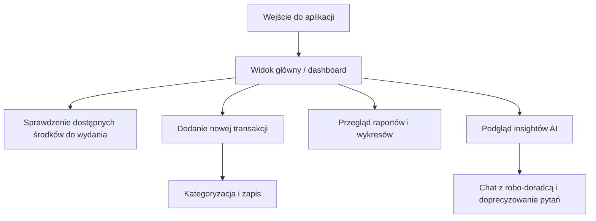
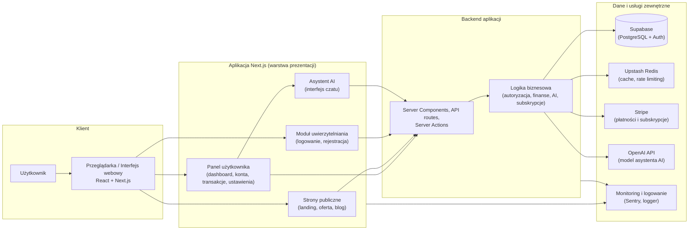
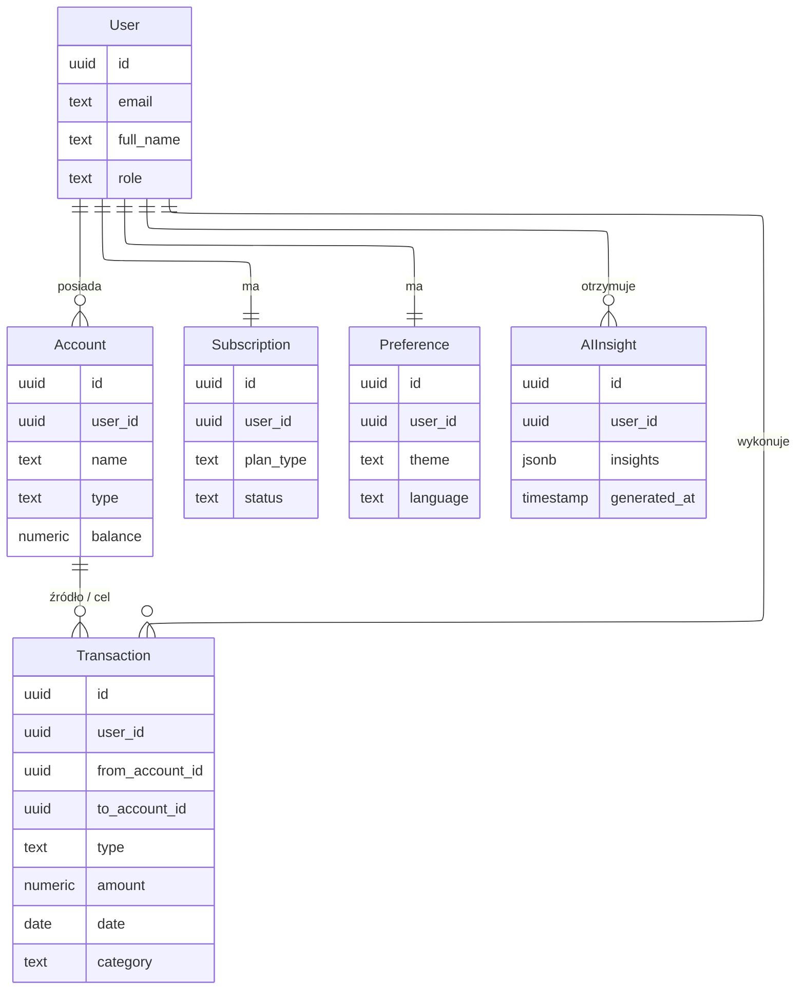

<!-- cSpell:disable -->

# 3. ANALIZA WYMAGAŃ I PROJEKT SYSTEMU

Rozdział trzeci przenosi rozważania z poziomu teoretycznego na poziom projektowy. Na podstawie wniosków z analizy literatury, przeglądu istniejących rozwiązań oraz charakterystyki technologii przedstawionych w rozdziale drugim, formułowane są tutaj wymagania wobec systemu Finwise oraz koncepcja jego projektu. Celem jest pokazanie, w jaki sposób założenia biznesowe, potrzeby użytkowników i ograniczenia technologiczne zostały przełożone na konkretną architekturę, model danych oraz rozwiązania UX. W kolejnym rozdziale (4) przedstawiona zostanie szczegółowa realizacja opisanych tutaj koncepcji w postaci kodu, konfiguracji i integracji z usługami zewnętrznymi.

## 3.1. Grupa docelowa i scenariusze użycia

Projekt Finwise oparto na założeniu, że żeby skutecznie pomagać ludziom zarządzać finansami, trzeba rozumieć, jak naprawdę zachowują się użytkownicy oraz czego potrzebują, żeby obsługa aplikacji była dla nich prosta i intuicyjna. Doświadczenia badawcze i praktyczne pokazują, że gospodarowania środkami pieniężnymi nie da się sprowadzić wyłącznie do księgowania transakcji. Kluczowe są tu takze nawyki, percepcja ryzyka oraz zdolność do planowania w dłuzszej perspektywie czasu. Równocześnie współczesne rozwiązania FinTech wskazują, że użytkownicy oczekują od aplikacji prostoty, przejrzystości i wysokiego poziomu personalizacji.

Poniżej przedstawiono uogolniony obraz grupy docelowej oraz główne scenariusze użycia, na których oparto dalsze decyzje projektowe. Podejście to zakłada, że projektowanie systemów złożonych, takich jak aplikacje finansowe, powinno rozpoczynać się od modelowania perspektywy użytkownika, a nie od listy funkcji.

### 3.1.1. Segmentacja użytkowników i personas

Na podstawie analizy rynku oraz materiałów literaturowych wyróżniono trzy główne segmenty użytkowników:

- **Użytkownik początkujący w finansach osobistych** – osoby młode lub wchodzące dopiero w rolę samodzielnego zarządzania budżetem, często o niskiej świadomości finansowej, zmagające się z trudnością w systematycznym śledzeniu wydatków. Dla tej grupy kluczowe są prostota interfejsu, minimalna liczba kroków oraz funkcje edukacyjne wplecione w interakcję z systemem.
- **Użytkownik zorientowany na optymalizację budżetu** – osoby, które posiadają już podstawowe nawyki prowadzenia budżetu, ale chcą głębiej analizować swoje wydatki, optymalizować strukturę kosztów i wykorzystywać bardziej zaawansowane raporty oraz rekomendacje. Ta grupa jest gotowa poświęcić więcej czasu na konfigurację celów i kategorii, o ile system oferuje realną wartość analityczną.
- **Użytkownik zaawansowany / prosumencki** – osoby śledzące finanse na poziomie wielu kont i produktów finansowych, zainteresowane prognozowaniem, scenariuszami „co-jeśli” oraz funkcjami AI wspierającymi podejmowanie decyzji. Dla takich użytkowników szczególnie istotne są personalizowane insighty, możliwość eksportu danych i wysoka kontrola nad prywatnością.

Na potrzeby projektowe z tych segmentów zdefiniowano zestaw uproszczonych person, np.:

- „Marta – młoda specjalistka IT, która chce uniezależnić się od arkuszy kalkulacyjnych i mieć czytelny widok na wydatki oraz wpływy”,
- „Piotr – trzydziestoparoletni użytkownik, który spłaca kredyt hipoteczny i szuka narzędzia do kontrolowania nadwyżek i oszczędności”,
- „Anna – freelancerka, rozliczająca kilka źródeł dochodu i chcąca łączyć perspektywę prywatną oraz zawodową”.

Tak zdefiniowane persony stanowią punkt odniesienia do dalszej priorytetyzacji funkcji oraz decyzji UX.

### 3.1.2. Kluczowe potrzeby i oczekiwane rezultaty

Analiza finansów osobistych oraz narzędzi FinTech pozwala wskazać kilka powtarzających się potrzeb, które stanowią wspólny mianownik dla opisanych segmentów:

- **Szybki wgląd w aktualną sytuację finansową** – użytkownicy oczekują natychmiastowej odpowiedzi na pytanie „ile mogę wydać” oraz prostych wskaźników, które sygnalizują, czy ich zachowanie jest zrównoważone w czasie.
- **Automatyzacja powtarzalnych czynności** – manualne wprowadzanie każdej transakcji jest postrzegane jako męczące; użytkownicy są skłonni korzystać z aplikacji długoterminowo tylko wtedy, gdy część pracy zostanie przejęta przez system.
- **Wsparcie decyzyjne zamiast samej ewidencji** – same tabele i wykresy nie przekładają się automatycznie na lepsze decyzje; konieczne jest przekształcenie danych w zrozumiałe sugestie i rekomendacje.
- **Poczucie kontroli i bezpieczeństwa** – w kontekście danych finansowych użytkownicy przywiązują dużą wagę do przejrzystej komunikacji zasad bezpieczeństwa, zgodności z regulacjami oraz możliwości łatwego eksportu lub usunięcia danych.

Oczekiwanym rezultatem z perspektywy użytkownika jest zatem nie tylko schludny dashboard, ale przede wszystkim system, który:

1. **Ułatwia zrozumienie, gdzie „uciekają” pieniądze** – poprzez czytelne kategoryzacje, wizualizacje i porównania w czasie.
2. **Wspiera budowanie dobrych nawyków** – poprzez subtelne przypomnienia, cele i sugestie („nudging”), zgodnie z koncepcją Thalera i Sunsteina (2008).
3. **Pozwala szybko reagować na odchylenia** – np. sygnały o nietypowych wydatkach czy rosnącym poziomie zobowiązań.

### 3.1.3. Priorytetyzacja przypadków użycia

Na bazie zdefiniowanych person i potrzeb opracowano katalog przypadków użycia, które następnie uporządkowano według priorytetu biznesowego i wartości dla użytkownika. W pierwszej kolejności skupiono się na scenariuszach „wysokiej częstotliwości i wysokiego wpływu”, a dopiero później na funkcjach zaawansowanych.

Do kluczowych, priorytetowych przypadków użycia zaliczono m.in.:

- **Codzienne śledzenie wydatków** – szybkie dodawanie transakcji, przegląd dzienny i tygodniowy, filtrowanie według kont i kategorii.
- **Miesięczne podsumowania i insighty AI** – automatycznie generowane podsumowania miesiąca oraz spersonalizowane rekomendacje dotyczące oszczędzania, redukcji kosztów lub zmian w strukturze wydatków.

Scenariusze o niższym priorytecie takie jak zaawansowane analizy scenariuszowe, integracje z zewnętrznymi systemami (open banking) czy rozbudowane moduły inwestycyjne, nie zostały ujęte w obecnym zakresie implementacji i traktowane są jako potencjalne rozszerzenia w kolejnych etapach rozwoju systemu.

Poniższy uproszczony diagram ilustruje przykładowy, wysokopoziomowy przepływ użytkownika w najważniejszym scenariuszu: codziennego korzystania z panelu Finwise.

Diagram 4. Uproszczony przepływ użytkownika w scenariuszu codziennego korzystania z panelu Finwise.

Diagram ten ma charakter ogólny i nie odzwierciedla konkretnych ekranów aplikacji, lecz wskazuje na główne kroki i punkty decyzyjne, które zostały następnie przełożone na wymagania funkcjonalne w kolejnym podrozdziale.

## 3.2. Wymagania funkcjonalne

Wymagania funkcjonalne systemu Finwise wynikają z połączenia trzech perspektyw: potrzeb użytkowników zidentyfikowanych w poprzednim podrodziale, analizy rozwiązań konkurencyjnych (Mint, YNAB, Revolut, PocketGuard) oraz dobrych praktyk projektowania systemów finansowych i SaaS. Ich celem jest zapewnienie spójnego zestawu funkcji, który pozwala użytkownikowi przejść pełną ścieżkę: od rejestracji, przez rejestrowanie transakcji i analizę danych, aż po korzystanie z modułów AI.

Ponizsze wymagania zostały pogrupowane według trzech głównych obszarów: user stories i przypadków użycia, zarządzania kontami i transakcjami oraz modułów AI, raportowania i eksportu danych. Taki podział sprzyja rozdzieleniu odpowiedzialności na poziomie domeny i ułatwia późniejsze odwzorowanie funkcji w architekturze aplikacji.

### 3.2.1. User stories i przypadki użycia

Podstawowym narzędziem opisu wymagań funkcjonalnych w projekcie są user stories, formułowane w schemacie „Jako [typ użytkownika] chcę [cel], aby [rezultat]”. Pozwala to utrzymać koncentrację na celu biznesowym i oczekiwanym efekcie, a nie na szczegółach implementacji. Przykładowy zestaw kluczowych user stories obejmuje:

- **Jako początkujący użytkownik** chcę zobaczyć na stronie głównej podstawowe metryki, takie jak łączny stan środków, suma wydatków, suma przychodów oraz poziom oszczędności, aby móc bez wysiłku ocenić swoją bieżącą sytuację finansową.
- **Jako osoba prowadząca wiele kont** chcę mieć możliwość rejestrowania transakcji między różnymi rachunkami (np. konto bieżące → konto oszczędnościowe), aby odzwierciedlać rzeczywiste przepływy środków i nie tracić globalnego obrazu sytuacji finansowej.
- **Jako użytkownik świadomy wartości czasu** chcę móc zaimportować dane finansowe w formacie CSV, aby uniknąć ręcznego przepisywania historii transakcji z innych systemów i szybciej rozpocząć pracę z aplikacją.
- **Jako użytkownik obawiający się nadmiernych zobowiązań** chcę, aby moduł AI podpowiadał mi obszary, w których wydatki rosną zbyt szybko, oraz sugerował możliwe ograniczenia na podstawie mojej historii transakcji, abym mógł odpowiednio wcześnie zareagować.

User stories zostały uporządkowane według wartości dla użytkownika i częstotliwości występowania, co wspiera iteracyjne planowanie zakresu prac.

### 3.2.2. Zarządzanie kontami i transakcjami

Niniejsza sekcja dotyczy głównej domeny funkcjonalnej systemu, czyli zarządzania kontami finansowymi oraz transakcjami. Przejrzysty model kont i przepływów finansowych jest kluczowy dla budowania świadomości ekonomicznej użytkownika oraz zrozumienia, jak poszczególne decyzje wpływają na jego sytuację finansową.

Najważniejsze wymagania obejmują:

- **Konta finansowe**:
  - możliwość tworzenia wielu kont o różnych typach (rachunek bieżący, oszczędnościowy, karta kredytowa, inwestycyjny),
  - oznaczanie kont kolorami i nazwami przyjaznymi użytkownikowi,
  - prezentację aktualnych sald oraz sumarycznego stanu majątku,
  - automatyczne utworzenie podstawowego konta („konto główne”) dla nowych użytkowników.
- **Transakcje**:
  - obsługę trzech podstawowych typów transakcji: przychody, wydatki i transfery pomiędzy kontami,
  - możliwość dodawania opisu, kategorii, notatek oraz daty,
  - przegląd historii z możliwością filtrowania po dacie, kwocie, kategorii i koncie,
  - edycję i usuwanie transakcji przy zachowaniu spójności sald.

### 3.2.3. Moduły AI, raportowania i eksportu danych

Trzecia grupa wymagań dotyczy funkcji, które odróżniają Finwise od klasycznych „zeszytów budżetowych”: modułów analitycznych, sztucznej inteligencji oraz mechanizmów eksportu danych. Kluczowe jest tu nie tylko prezentowanie suchych liczb, ale także przekształcanie ich w zrozumiałe rekomendacje oraz zapewnienie użytkownikowi pełnej kontroli nad własnymi danymi. W tym kontekście sformułowano następujące wymagania:

- **Dashboard i raporty**:
  - prezentacja miesięcznych podsumowań przychodów i wydatków,
  - analiza wydatków według kategorii,
  - wykresy trendów sald oraz przepływów w czasie,
  - możliwość filtrowania i zawężania zakresu analizy do wybranych kont lub kategorii.
- **Moduł AI**:
  - generowanie cyklicznych insightów (np. podsumowanie miesiąca, wskazanie niestandardowych wydatków, rekomendacje oszczędnościowe),
  - interfejs konwersacyjny umożliwiający zadawanie pytań w języku naturalnym („Dlaczego w tym miesiącu wydałem więcej na jedzenie?”) i uzyskanie odpowiedzi osadzonych w danych użytkownika,
  - mechanizmy ograniczania liczby zapytań w zależności od planu subskrypcyjnego oraz możliwość śledzenia zużycia.
- **Eksport i kontrola nad danymi**:
  - możliwość pobrania podsumowań w formie zagregowanych danych (np. w pliku CSV/JSON) do dalszej analizy,
  - opcjonalny eksport wybranych zakresów danych, co wspiera wymagania transparentności i prawa do przenoszenia danych.

Wymagania te tworzą spójny system funkcji, który pozwala użytkownikowi wprowadzać dane, analizować je z pomocą modułów AI oraz w razie potrzeby eksportować pełny obraz swoich finansów.

## 3.3. Wymagania niefunkcjonalne

Wymagania niefunkcjonalne definiują ramy jakościowe, w jakich musi funkcjonować system Finwise. Obejmują one wydajność, dostępność, bezpieczeństwo oraz zgodność regulacyjną. To właśnie te aspekty w największym stopniu determinują zaufanie użytkowników do platformy. W przypadku usług FinTech wymogi te są dodatkowo poparte regulacjami europejskimi (np. RODO, wytyczne nadzorcze) oraz standardami technicznymi np. OWASP Top 10 i WCAG 2.1.

### 3.3.1. Wydajność, dostępność i skalowalność

System Finwise, jako aplikacja typu SaaS udostępniana w modelu chmurowym, musi zapewnić stabilną pracę przy zmiennym obciążeniu oraz rosnącej liczbie użytkowników. Kluczowe jest tu wykorzystanie skalowalnych usług backendowych oraz oddzielenie warstw odpowiedzialnych za prezentację, logikę biznesową i dane.

Na tej podstawie przyjęto następujące wymagania:

- **Czas odpowiedzi**:
  - podstawowe widoki (dashboard, lista transakcji) powinny ładować się w czasie akceptowalnym z perspektywy użytkownika, typowo poniżej 2–3 sekund przy standardowym łączu,
  - operacje krytyczne, takie jak dodanie transakcji czy zmiana ustawień, powinny być wykonywane w sposób płynny, z natychmiastowym odświeżaniem widoku tam, gdzie to możliwe.
- **Dostępność**:
  - system powinien zapewniać wysoki poziom dostępności, tak aby użytkownik mógł w praktyce korzystać z aplikacji w sposób ciągły, bez odczuwalnych przerw w działaniu,
  - system powinien być odporny na częściowe awarie poszczególnych usług zewnętrznych, a w przypadku niedostępności modułu AI lub płatności zapewniać czytelne komunikaty i tryb degradacji funkcjonalności.
- **Skalowalność**:
  - architektura powinna umożliwiać poziome skalowanie komponentów aplikacyjnych (Next.js, API, funkcje serverless) oraz pionowe skalowanie warstwy bazy danych,
  - wykorzystanie usług takich jak CDN i cache po stronie edge (np. Vercel, Upstash) ma redukować opóźnienia i odciążać bazę danych, przy jednoczesnym zachowaniu spójności danych finansowych.

Wymagania te odzwierciedlają ogólne założenia dotyczące projektowania wydajnych i elastycznych systemów FinTech, które muszą być gotowe na stopniowe skalowanie bez radykalnej przebudowy architektury.

### 3.3.2. Bezpieczeństwo danych i zgodność z RODO

Bezpieczeństwo stanowi krytyczny wymiar jakości systemu finansowego. Ochrona danych nie może być realizowana wyłącznie na poziomie warstwy aplikacyjnej - konieczne jest podejście warstwowe, obejmujące szyfrowanie, kontrolę dostępu i monitorowanie. Dodatkowo system Finwise, przetwarzając dane użytkowników z Europejskiego Obszaru Gospodarczego, musi być projektowany w duchu privacy by design zgodnie z RODO. Szczegółowa, formalna ocena zgodności z RODO wykracza jednak poza zakres niniejszej pracy i dotyczy przede wszystkim aspektów organizacyjno-prawnych, a nie wyłącznie technicznych.

Najważniejsze wymagania obejmują:

- **Autoryzacja i kontrola dostępu**:
  - jednoznaczne powiązanie danych z konkretnym użytkownikiem oraz egzekwowanie zasady, że każdy użytkownik widzi wyłącznie swoje dane (np. poprzez Row Level Security w bazie danych),
  - stosowanie mechanizmów silnego uwierzytelniania (hasła o odpowiedniej złożoności, logowanie bezhasłowe), zgodnych z dobrymi praktykami opisanymi w standardach bezpieczeństwa.
- **Ochrona danych osobowych**:
  - szyfrowanie danych, w tym bezpieczne przechowywanie haseł,
  - minimalizacja zakresu gromadzonych informacji oraz możliwość łatwego eksportu i usunięcia danych, co odpowiada zasadom RODO i przejrzystości systemów AI,

Wymagania te stanowią punkt odniesienia dla szczegółowych decyzji implementacyjnych, takich jak dobór mechanizmów szyfrowania, struktura logowania wydarzeń, wybór dostawców usług chmurowych i konfiguracja narzędzi monitorujących.

### 3.3.3. Dostępność (WCAG) i doświadczenie użytkownika

Dostępność i jakość doświadczenia użytkownika są w przypadku Finwise nie tylko wymogiem ergonomicznym, ale także jednym z głównych czynników wpływających na adopcję i długoterminowe korzystanie z systemu. Czytelność interfejsu oraz jasna hierarchia informacji przekładają się na wyższy poziom zaufania i satysfakcji.

W kontekście wymagań niefunkcjonalnych przyjęto, że:

- **System powinien być projektowany zgodnie z wytycznymi WCAG 2.1 na poziomie co najmniej AA**, co obejmuje m.in. odpowiedni kontrast kolorów, możliwość obsługi klawiaturą, czytelne etykiety i alternatywne opisy dla treści wizualnych.
- **Interfejs musi uwzględniać różne poziomy „dojrzałości finansowej” użytkowników** – osoby o niższej wiedzy finansowej powinny otrzymywać bardziej objaśniające wizualizacje i komunikaty, z kolei użytkownicy zaawansowani potrzebują możliwości zagłębienia się w dane bez zbędnej narracji.
- **Projekt powinien być zgodny z heurystykami użyteczności**, takimi jak widoczność stanu systemu, kontrola i swoboda użytkownika czy zapobieganie błędom, co jest szczególnie istotne w kontekście działań finansowych, gdzie błędy mogą mieć realne konsekwencje.

Doświadczenia z projektowania interfejsów danych pokazują również, że dobrze zaprojektowane wykresy powinny pomagać użytkownikowi w interpretacji złożonych informacji bez generowania dodatkowego obciążenia poznawczego. W praktyce oznacza to m.in. ograniczenie liczby jednocześnie prezentowanych wskaźników, stosowanie intuicyjnych kolorów (np. zielony dla nadwyżek, czerwony dla deficytów) oraz konsekwentne stosowanie tej samej „gramatyki wizualnej” w całym systemie.

Uwzględnienie powyższych wymagań ma zapewnić, że Finwise będzie narzędziem nie tylko funkcjonalnym i bezpiecznym, ale również przyjazny dla różnych grup użytkowników – od osób stawiających pierwsze kroki w zarządzaniu budżetem, po zaawansowanych uzytkownikow korzystających z modułów AI i rozbudowanej analityki.

## 3.4. Architektura systemu

Architektura Finwise została zaprojektowana jako lekki, modularny system SaaS oparty na platformie Next.js oraz usługach backendowych typu BaaS, takich jak Supabase, Stripe i OpenAI. Celem było połączenie wysokiej elastyczności i skalowalności z przejrzystym rozdzieleniem odpowiedzialności pomiędzy warstwy: prezentacji, logiki domenowej i danych. Założenia te są spójne z ogólnymi zasadami projektowania nowoczesnych systemów webowych, w tym podejściem clean architecture, akcentującym separację warstw i niezależność rdzenia domenowego od szczegółów infrastrukturalnych.

W niniejszej sekcji przedstawiono uproszczony obraz architektury, skupiając się na roli poszczególnych komponentów oraz integracjach z usługami zewnętrznymi.

### 3.4.1. Diagram architektury

Na wysokim poziomie system składa się z czterech głównych obszarów: warstwy klienckiej (przeglądarka), aplikacji Next.js (w tym server actions i API routes), warstwy logiki biznesowej (serwisy domenowe) oraz warstwy danych i usług zewnętrznych. Poniższy diagram prezentuje uproszczoną architekturę i główne kierunki przepływu żądań.

Diagram 5. Wysokopoziomowa architektura systemu Finwise.

Taki podział pozwala na:

- **oddzielenie warstwy prezentacji od logiki biznesowej** – co jest zgodne z zaleceniami clean architecture i ułatwia dalszą rozbudowę systemu,
- **centralizację logiki domenowej w serwisach** – co sprzyja spójności reguł biznesowych, np. dotyczących naliczania sald czy uprawnień do danych,
- **wykorzystanie server actions i API routes jako cienkiej warstwy integracyjnej** – skupionej na walidacji danych wejściowych, przekazywaniu ich do odpowiednich serwisów oraz obsłudze mechanizmów bezpieczeństwa (rate limiting, uwierzytelnianie).

Przyjęta architektura wpisuje się w trend łączenia architektury serwerless z usługami BaaS, w którym część odpowiedzialności (uwierzytelnianie, przechowywanie danych, integracje płatnicze) delegowana jest do wyspecjalizowanych platform chmurowych. Pełną, wysokorozdzielczą wersję diagramu architektury wraz z dodatkowymi oznaczeniami komponentów zamieszczono w Załączniku 8.1.1.

### 3.4.2. Integracja OpenAI (AI assistant)

Moduł AI w Finwise został zaprojektowany jako odrębna warstwa usług nadbudowana nad rdzeniem domenowym systemu. AI nie powinna zastępować klasycznych funkcji analitycznych, ale je uzupełniać, przekształcając dane finansowe w bardziej zrozumiałe opisy i rekomendacje.

Z projektowego punktu widzenia przyjęto następujące założenia:

- **AI operuje wyłącznie na danych przetworzonych wcześniej przez warstwę domenową**, takich jak miesięczne podsumowania, struktura kategorii wydatków czy proste wskaźniki relacji między przychodami i wydatkami. Dzięki temu do modułu AI nie trafiają pojedyncze, surowe rekordy transakcji, co ogranicza ryzyko ujawniania zbędnych szczegółów.
- **Zapytania do OpenAI są kontrolowane przez dedykowany serwis**, który:
  - sprawdza limity wykorzystania przypisane do planu subskrypcyjnego,
  - rejestruje każde wywołanie na potrzeby audytu i analizy kosztów,
  - w razie potrzeby zwraca wyniki fallbackowe (reguły bazowe).
- **Interfejs użytkownika traktuje insighty AI jako propozycje, nie „prawdy absolutne”**. W warstwie UX oznacza to wyraźne rozróżnienie pomiędzy danymi „twardymi” (saldami, kwotami) a sugestiami generowanymi przez model.

Takie podejście do integracji AI pozwala korzystać z zalet modeli językowych (personalizacja, zrozumiała narracja), jednocześnie ograniczając ryzyka związane z nadmiernym zaufaniem do algorytmów i wspierając przejrzystość oraz równe traktowanie różnych grup użytkowników.

### 3.4.3. Integracja Stripe (billing i subskrypcje)

Obsługa modeli subskrypcyjnych w Finwise opiera się na platformie Stripe, która odpowiada za proces pozyskania płatności, zarządzanie planami oraz realizację cyklicznych obciążeń. Powierzenie tej części logiki wyspecjalizowanej usłudze pozwala zminimalizować ryzyko błędów bezpieczeństwa oraz uprościć zgodność z regulacjami finansowymi.

Na poziomie architektury:

- aplikacja Finwise inicjuje proces subskrypcji lub zmiany planu poprzez wywołanie 'server actions', która komunikuje się z API Stripe,
- użytkownik dokonuje płatności w bezpiecznym środowisku Stripe (Checkout / Customer Portal),
- informacje o stanie subskrypcji są synchronizowane z bazą Finwise za pomocą webhooków, co zapewnia spójność danych nawet w przypadku zmian inicjowanych po stronie Stripe.

Takie rozwiązanie wpisuje się we wzorce integracji FinTech, w których logika biznesowa systemu koncentruje się na zarządzaniu uprawnieniami i poziomami dostępu, a dane wrażliwe związane z płatnościami są przetwarzane wyłącznie po stronie wyspecjalizowanego dostawcy (Stripe).

### 3.4.4. Integracja Supabase i Upstash (autoryzacja, RLS, cache)

Supabase pełni w projekcie podwójną rolę: źródła danych (PostgreSQL) oraz dostawcy mechanizmów uwierzytelniania i autoryzacji. Dzięki wykorzystaniu polityk Row Level Security logika kontroli dostępu zostaje osadzona bezpośrednio w warstwie bazy danych, co minimalizuje ryzyko błędów implementacyjnych po stronie aplikacji i jest zgodne z ideą „security by design” (todo: wyjasnic). Połączenie RLS z odpowiednim podziałem schematu bazy na tabele i indeksy stanowi skuteczną metodę zapewnienia izolacji danych wielu użytkowników w jednym systemie.

Upstash (Redis) wykorzystywany jest głównie do:

- realizacji mechanizmów rate limiting (np. w kontekście logowania, zapytań do API i modułu AI),
- przechowywania lekkich danych tymczasowych, które poprawiają responsywność systemu bez naruszania spójności danych finansowych.

Tak skonstruowana architektura oparta na usługach serverless, BaaS i lekkiej warstwie logiki biznesowej pozwala na elastyczne skalowanie, łatwe rozszerzanie funkcji oraz stopniową ewolucję w kierunku bardziej złożonych modeli.

## 3.5. Projekt bazy danych

Projekt bazy danych dla Finwise pełni fundamentalną rolę w trzech obszarach: zapewnieniu spójności danych finansowych, umożliwieniu ich dalszej analizy oraz wspieraniu mechanizmów bezpieczeństwa. Model danych powinien w pierwszej kolejności odzwierciedlać logikę domeny (konta, transakcje, subskrypcje, preferencje użytkownika), a dopiero w drugiej kolejności uwzględniać specyfikę użytych technologii. W przypadku systemów finansowych szczególnie ważne jest, aby struktura bazy była przejrzysta z punktu widzenia przepływów pieniężnych – tak, aby użytkownik i projektant mogli łatwo powiązać elementy rzeczywistości (np. konta i operacje na nich) z odpowiadającymi im obiektami w aplikacji.

W tej sekcji przedstawiono koncepcyjny model danych w postaci uproszczonego diagramu ERD oraz opisano główne encje i powiązania między nimi. Opis ma charakter abstrakcyjny i nie wchodzi w szczegóły dotyczące konkretnej implementacji w Supabase.

### 3.5.1. Diagram ERD i kluczowe encje

Na wysokim poziomie logicznym model danych Finwise obejmuje następujące encje:

- **User** – reprezentuje użytkownika systemu i jego profil,
- **Account** – rachunki finansowe użytkownika (np. bieżące, oszczędnościowe, kredytowe),
- **Transaction** – pojedyncze operacje finansowe (przychody, wydatki, transfery),
- **Subscription** – informacje o planie subskrypcyjnym Finwise,
- **Preference** – ustawienia interfejsu i powiadomień,
- **AIInsight** – zapis wygenerowanych insightów i podsumowań AI.

Uproszczony diagram relacji pomiędzy tymi encjami przedstawiono poniżej:

Diagram 6. Uproszczony diagram ERD modelu danych systemu Finwise.

Diagram ukazuje główne relacje i odpowiedzialności encji, a nie zaś wszystkie kolumny, indeksy czy ograniczenia właściwe dla docelowej bazy danych. Takie podejście pozwala oddzielić model logiczny od fizycznej implementacji i zachować elastyczność przy zmianach technologicznych. Szczegółowy diagram ERD w wersji pełnej, obejmujący wszystkie encje, pola i powiązania, został dołączony w Załączniku 8.1.2.

### 3.5.2. Reguły RLS i polityki bezpieczeństwa

Projekt bazy danych Finwise zakłada wykorzystanie polityk Row Level Security (RLS) jako głównego mechanizmu egzekwowania kontroli dostępu. Przeniesienie części logiki autoryzacji na poziom bazy danych ogranicza ryzyko błędów implementacyjnych po stronie aplikacji oraz umożliwia prostsze weryfikowanie zgodności z wymaganiami regulacyjnymi.

Kluczowe założenia polityk bezpieczeństwa to:

- każda encja zawierająca dane użytkownika (np. `Account`, `Transaction`, `AIInsight`) posiada kolumnę identyfikującą użytkownika (np. `user_id`),
- dla tabel z danymi osobowymi obowiązują polityki RLS zabraniające odczytu, modyfikacji i usuwania rekordów przez użytkowników, którzy nie są ich właścicielami,
- operacje administracyjne i integracyjne (np. przetwarzanie webhooków Stripe) wykonują się z użyciem specjalnych ról serwisowych, objętych osobnymi zasadami dostępu.

Przy projektowaniu tych mechanizmów kierowano się ogólnie przyjętymi dobrymi praktykami bezpieczeństwa dla systemów finansowych, takimi jak warstwowe podejście do ochrony danych, ograniczanie uprawnień oraz konsekwentne rozdzielanie ról technicznych.

### 3.5.3. Strategie migracji oraz backupu

Ze względu na charakter danych finansowych i wymogi ciągłości działania systemu, projekt bazy danych Finwise musi uwzględniać mechanizmy bezpiecznych migracji schematu oraz procedury tworzenia kopii zapasowych. Zmiany w modelu danych powinny być wprowadzane w sposób ewolucyjny („migracje w przód i w tył”), z zachowaniem kompatybilności pomiędzy kolejnymi wersjami aplikacji.

Z tego względu przyjęto następujące założenia:

- wszystkie zmiany schematu bazy danych są wprowadzane poprzez kontrolowane migracje, wersjonowane w repozytorium kodu, co umożliwia odtworzenie dowolnego stanu bazy w razie potrzeby,
- migracje są projektowane w sposób minimalizujący czas niedostępności systemu, np. poprzez dodawanie nowych kolumn/tablic równolegle i stopniowe przenoszenie danych,
- regularnie wykonywane są automatyczne kopie zapasowe bazy danych, przechowywane w odseparowanym, bezpiecznym środowisku, z możliwością przywrócenia danych do wybranego punktu w czasie.

Takie strategie są spójne z ogólnymi praktykami stosowanymi w systemach FinTech, w których zarządzanie ryzykiem technicznym np. utratą danych, jest traktowane jako integralna część projektowania niezawodnego systemu. Projekt bazy danych Finwise uwzględnia te wymagania już na etapie koncepcyjnym, co ułatwia późniejsze spełnienie standardów jakości i bezpieczeństwa opisanych w rozdziale 5.

## 3.6. Modele UX

Doświadczenie użytkownika (UX) stanowi juz ostatni filar systemu Finwise. Nawet najbardziej rozbudowane funkcje analityczne czy moduły AI nie spełnią swojej roli, jeśli użytkownik nie będzie w stanie w prosty sposób znaleźć potrzebnych informacji i przeprowadzić podstawowych operacji. W tym podrozdziale przedstawiono główne założenia dotyczące organizacji widoków, prezentacji danych oraz dostępności interfejsu.

### 3.6.1. Model nawigacji i główne widoki

Finwise został zaprojektowany jako aplikacja, w której punktem wyjścia jest widok główny (dashboard). Po zalogowaniu użytkownik widzi w jednym miejscu syntetyczne informacje o swojej sytuacji finansowej: łączny stan środków, podstawowe metryki oraz skróty do najważniejszych działań (dodanie transakcji, przejście do listy kont, wywołanie modułu AI). Wybrane widoki interfejsu (strona główna, dashboard, formularze transakcji oraz panel asystenta AI) zilustrowano na zrzutach ekranu w Załączniku 8.1.3.

Model nawigacji opiera się na kilku czytelnych obszarach:

- **dashboard** – widok podsumowujący, przeznaczony do szybkiego „rzutu oka” na finanse,
- **konta i transakcje** – listy oraz formularze pozwalające przeglądać i edytować dane finansowe,
- **moduł AI** – insighty oraz interfejs czatu z robo‑doradcą, umożliwiający zadawanie pytań w języku naturalnym,
- **ustawienia** – konfiguracja profilu, preferencji oraz parametrów działania systemu.

Takie uporządkowanie ma na celu ograniczenie liczby kroków potrzebnych do realizacji typowych zadań oraz zmniejszenie ryzyka dezorientacji użytkownika w interfejsie. Zadbano również o to, aby na pojedynczym ekranie nie prezentować nadmiernej liczby komponentów. Zamiast gęsto upakowanych wykresów i tabel zastosowano mniejszą liczbę, dobrze opisanych bloków informacji.

### 3.6.2. Responsywność i prezentacja danych

Interfejs Finwise jest w pełni responsywny, co oznacza, że ten sam zestaw widoków pozostaje wygodny w użyciu zarówno na ekranach mobilnych, jak i na większych monitorach. Układ elementów automatycznie dostosowuje się do dostępnej przestrzeni, tak aby na każdym urządzeniu zachować czytelność i łatwy dostęp do kluczowych informacji.

Ważnym aspektem UX w systemie finansowym jest sposób prezentacji danych liczbowych. W Finwise przyjęto następujące zasady:

- najważniejsze wartości (np. łączny stan środków, suma wydatków) są wyróżnione typograficznie i umieszczone w górnej części widoku,
- wykresy i tabele są opatrzone jednoznacznymi etykietami oraz legendą, co ułatwia ich interpretację,
- stosowana jest spójna „gramatyka wizualna” – te same kolory i kształty oznaczają te same typy informacji w różnych częściach aplikacji.

Zastosowanie dwóch motywów kolorystycznych – jasnego i ciemnego – ma na celu umożliwienie komfortowej pracy zarówno w jasnym, jak i ciemnym otoczeniu. Kontrasty kolorystyczne zostały dobrane tak, aby spełniały wymagania WCAG 2.1 i zapewniały czytelność także w komponentach wizualnych, takich jak wykresy.

### 3.6.3. Dostępność i współpraca z modułem AI

Projekt UX Finwise uwzględnia podstawowe wytyczne dostępności (WCAG 2.1) oraz sprawdzone heurystyki użyteczności. W szczególności:

- interfejs zapewnia **widoczność stanu systemu** – użytkownik otrzymuje jasną informację o tym, czy operacja (np. dodanie transakcji, wygenerowanie insightów AI) jest w toku czy została zakończona,
- stosowana jest terminologia bliska językowi użytkownika („konto”, „transakcja”, „budżet”), co ułatwia zrozumienie prezentowanych funkcji,
- formularze są walidowane tak, aby możliwie wcześnie wychwytywać błędy i zapobiegać przypadkowym operacjom o potencjalnie niepożądanych skutkach.

Szczególne znaczenie ma sposób, w jaki interfejs integruje się z modułem AI. Odpowiedzi robo‑doradcy są prezentowane w kontekście danych użytkownika, a system umożliwia zadawanie pytań uzupełniających oraz ignorowanie sugerowanych rekomendacji. Ma to na celu wzmocnienie poczucia kontroli oraz uniknięcie sytuacji, w której użytkownik bezrefleksyjnie polega na sugestiach algorytmu.

Podsumowując, modele UX zastosowane w Finwise koncentrują się na przejrzystej nawigacji, czytelnej prezentacji danych, spójnej responsywności oraz bezpiecznej współpracy z modułem AI. Wszystko to ma wspierać użytkownika w podejmowaniu bardziej świadomych decyzji finansowych, bez zbędnego obciążenia poznawczego.
