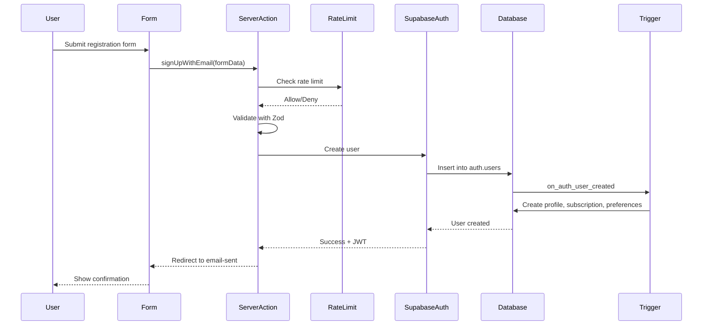
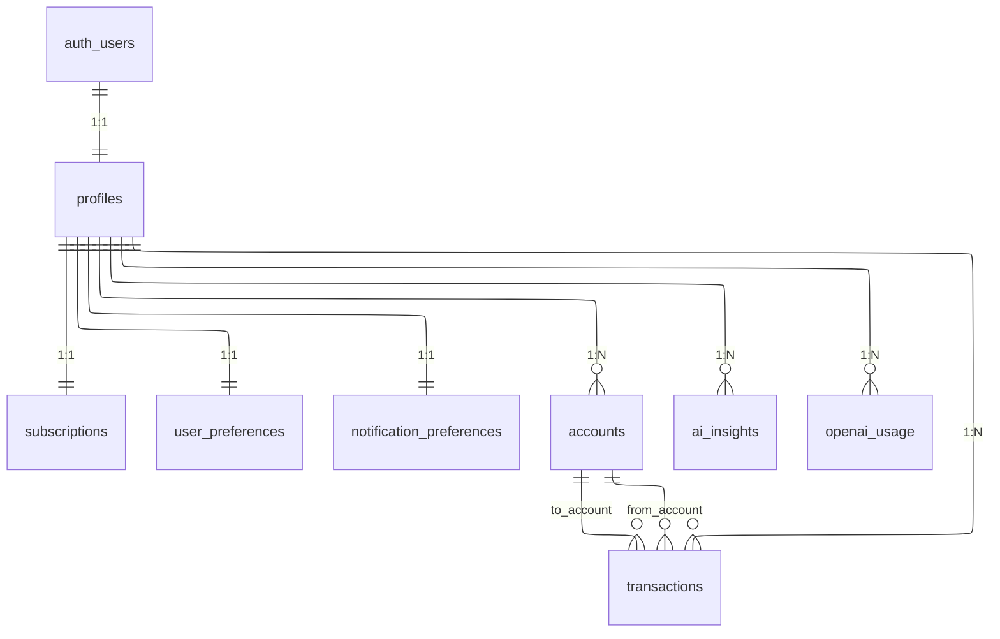
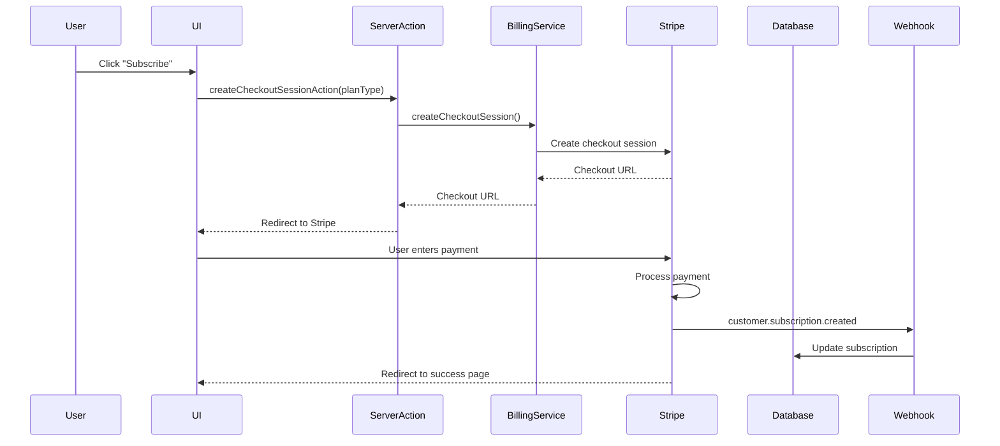
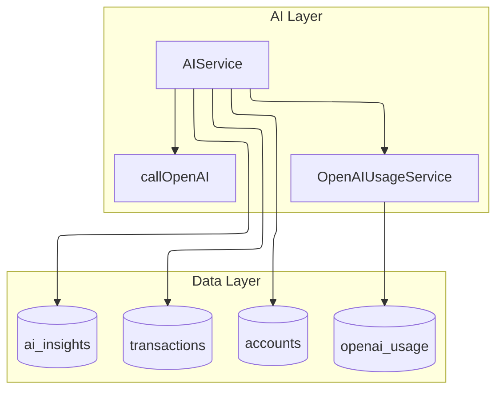
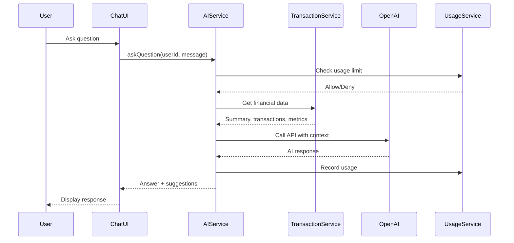

<!-- cSpell:disable -->

# 4. IMPLEMENTACJA

Rozdział czwarty przenosi opis systemu Finwise z poziomu wymagań i architektury na poziom faktycznej realizacji w kodzie, konfiguracjach i integracjach zewnętrznych. W tej części przedstawiono, w jaki sposób zaprojektowany w rozdziale trzecim model domenowy, architektura SaaS oraz wymagania niefunkcjonalne zostały odwzorowane przy użyciu stosu technologicznego opartego na Next.js, Supabase, Stripe, OpenAI API, Upstash Redis oraz usługach chmurowych Vercel.

## 4.1. Stack technologiczny

W tej części przedstawiono technologie wchodzące w skład stosu Finwisem który oparty jest na nowoczesnym ekosystemie JavaScript oraz usługach typu BaaS. Implementacja łączy Next.js 15 z App Routerem, silne typowanie w TypeScript, system stylowania oparty na TailwindCSS i komponentach shadcn/ui, a także usługi Supabase, Stripe, OpenAI, Upstash oraz narzędzia Vercel, Pino i Sentry, tworząc spójny szkielet aplikacji SaaS.

### 4.1.1. Next.js, TypeScript, TailwindCSS, shadcn/ui

Do implementacji warstwy prezentacji i logiki interfejsu użytkownika wykorzystano framework Next.js 15.5.7 oparty na React 19, w trybie App Router. Aplikacja działa w architekturze serverless na Vercel, co pozwala łączyć serwerowe komponenty Reacta, server actions oraz klasyczne API routes w ramach jednego monolitu aplikacyjnego. Cały kod pisany jest w TypeScript w trybie `strict`, dzięki czemu typy domenowe (np. profile użytkowników, subskrypcje, transakcje) są spójne z typami generowanymi z bazy danych Supabase i wykorzystywane na wszystkich poziomach, od serwisów po komponenty UI.

System stylowania oparto na TailwindCSS 4, który zapewnia narzędziową składnię klas CSS oraz ułatwia budowanie responsywnych widoków dashboardu, list kont i formularzy. Na tej warstwie osadzono bibliotekę komponentów shadcn/ui bazującą na Radix UI. W projekcie wykorzystano m.in. komponenty przycisków, formularzy, przełączników trybu ciemnego, kart oraz modalnych okien dialogowych. Komponenty te są dostosowane do potrzeb Finwise, a ich integracja z TailwindCSS umożliwia zachowanie spójnej „gramatyki wizualnej” w całej aplikacji.

Formularze (m.in. rejestracji, logowania, aktualizacji profilu, konfiguracji subskrypcji) zaimplementowano z użyciem React Hook Form oraz walidacji schematów Zod, zgodnie z podejściem _schema‑first_ opisanym w oficjalnej dokumentacji. Dzięki temu walidacja wejścia jest wykonywana zarówno po stronie klienta, jak i na poziomie server actions, a błędy walidacyjne są zwracane w ujednoliconym formacie i mapowane na komunikaty interfejsu (Zod Documentation, 2025).

### 4.1.2. Supabase, PostgreSQL, OAuth2, JWT

Warstwa danych Finwise opiera się na Supabase, który udostępnia zarządzaną instancję PostgreSQL oraz moduł uwierzytelniania Supabase Auth. Wdrożono w niej model danych opisany w rozdziale trzecim, obejmujący tabele profiles, subscriptions, user_preferences, notification_preferences, a także domenowe tabele finansowe accounts i transactions oraz tabelę ai_insights przechowującą wygenerowane przez moduł AI podsumowania. Baza danych wykorzystuje typy wyliczeniowe PostgreSQL (subscription_status, user_role, account_type, transaction_type), które ograniczają możliwe wartości pól stanu subskrypcji, roli użytkownika oraz rodzaju konta i transakcji, oraz zestaw indeksów zoptymalizowanych pod najczęstsze zapytania, takie jak wyszukiwanie subskrypcji po użytkowniku czy filtrowanie transakcji po dacie i typie (PostgreSQL Documentation, 2025).

Supabase Auth zapewnia implementację protokołu OAuth2 oraz sesji opartych na tokenach JWT, zgodnie z oficjalnymi przewodnikami i specyfikacjami. W aplikacji udostępniono kilka metod logowania: logowanie bezhasłowe z użyciem magic link oraz integracje OAuth z dostawcami takimi jak GitHub i Google. Po stronie Next.js sesje użytkowników obsługiwane są przez middleware, który przy każdym żądaniu odczytuje ciasteczka, weryfikuje ważność tokenu i w razie potrzeby odświeża go z użyciem refresh tokena (Supabase Documentation, 2025).

Bezpieczeństwo danych użytkownika w warstwie bazy realizowane jest za pomocą mechanizmu Row Level Security. Dla tabel `profiles` i `subscriptions` zdefiniowano polityki RLS, które wymuszają zgodność identyfikatora użytkownika z funkcją `auth.uid()`, dzięki czemu warstwa aplikacji nie musi ręcznie filtrować rekordów po kolumnie `user_id`. Operacje administracyjne i webhooki Stripe korzystają z tzw. service role client, który działa w osobnej roli serwisowej i może obchodzić RLS wyłącznie w ściśle określonych miejscach, takich jak synchronizacja subskrypcji.

Uzupełnieniem tej warstwy jest funkcja `handle_new_user()` osadzona jako trigger w schemacie bazy, która po utworzeniu rekordu w `auth.users` automatycznie tworzy powiązany profil, subskrypcję warstwy darmowej oraz rekordy z domyślnymi preferencjami użytkownika. Dzięki temu warstwa aplikacji nie musi martwić się o spójność danych przy rejestracji, a logika inicjalizacji zostaje utrzymana najbliżej danych.

### 4.1.3. Stripe, OpenAI API, Upstash, Vercel, Pino, Sentry

Za obsługę płatności subskrypcyjnych w Finwise odpowiada Stripe. Po stronie aplikacji zdefiniowano warstwę integracji w katalogu src/lib/stripe, obejmującą konfigurację klienta Stripe, funkcje do tworzenia sesji Checkout, zarządzania subskrypcjami oraz obsługi webhooków. Sposób tworzenia sesji Checkout, weryfikacji sygnatur webhooków i mapowania identyfikatorów price_id na plany aplikacji odtworzono zgodnie z przykładowymi przepływami opisanymi w dokumentacji Stripe (Stripe Documentation, 2025). Same operacje biznesowe, np. aktualizacja wpisu w tabeli `subscriptions`, są delegowane do serwisów domenowych, zgodnie z podziałem opisanym w podrozdziale 4.3.

Moduł sztucznej inteligencji zbudowano na bazie OpenAI API, korzystając z modelu GPT‑4o‑mini. Zgodnie z oficjalną dokumentacją OpenAI API każde wywołanie zwraca szczegółowe metadane dotyczące liczby zużytych tokenów oraz podlega limitom zapytań przypisanym do klucza API (OpenAI Documentation, 2025). W projekcie wyodrębniono `AIService` odpowiedzialny za przygotowanie kontekstu finansowego użytkownika (podsumowania, agregacje, listy transakcji) i budowanie promptów, a także `OpenAIUsageService`, który na podstawie tych metadanych śledzi liczbę zapytań i zużytych tokenów w tabeli `openai_usage`. Dzięki temu możliwe jest powiązanie zapytań AI z planem subskrypcyjnym oraz implementacja twardych limitów liczby zapytań w miesiącu.

Do implementacji mechanizmów rate limiting wykorzystano Upstash Redis. W katalogu `src/lib/ratelimit` zdefiniowano osobne limitery dla akcji uwierzytelniania (np. logowanie, rejestracja, reset hasła), operacji subskrypcyjnych oraz wybranych działań powiadomień, które następnie są wywoływane z poziomu server actions (np. `checkAuthRateLimit`, `checkBillingRateLimit`). Zastosowany algorytm sliding window rate limiting, udostępniany przez Upstash, pozwala na płynniejsze rozłożenie ruchu niż klasyczne, sztywne przedziały czasowe, a klucze limitów oparte na adresie IP lub identyfikatorze użytkownika umożliwiają przypisanie limitów do konkretnego klienta (Upstash Documentation, 2025).

Cała aplikacja jest budowana i wdrażana na platformie Vercel, która pełni rolę hostingu, CDN oraz środowiska uruchomieniowego dla serverless functions. Next.js middleware oraz API routes działają w funkcjach edge lub standardowych lambdach, a statyczne zasoby są serwowane z globalnej sieci CDN minimalizującej opóźnienia. Z perspektywy implementacyjnej sprowadza się to do konfiguracji projektu w pliku konfiguracyjnym Next.js oraz zestawu zmiennych środowiskowych przekazywanych z panelu Vercel (Vercel Documentation, 2025).

Do logowania i monitorowania zastosowano dwa komplementarne narzędzia. Pino służy jako logger strukturalny po stronie serwera - serwisy oraz krytyczne fragmenty server actions wykorzystują ujednolicone komunikaty zdefiniowane w `src/lib/constants/logs.ts`, co umożliwia późniejszą analizę w systemach logujących (Pino Documentation, 2025). Sentry natomiast zapewnia centralne zbieranie błędów i metryk wydajności zarówno po stronie klienta, jak i serwera. W plikach `instrumentation.ts` oraz `sentry/instrumentation-client.ts` skonfigurowano integrację Sentry dla Next.js, włączając rejestrowanie wyjątków, śledzenie transakcji oraz w razie potrzeby, sesyjne nagrania interakcji użytkownika (Sentry Documentation, 2025).

## 4.2. Frontend

W tej części opisano implementację warstwy frontendowej Finwise: strukturę aplikacji w App Routerze, wzorce wykorzystania server actions, system komponentów oraz rozwiązania związane z personalizacją interfejsu i dostępnością. Celem było takie zaprojektowanie interfejsu, aby ściśle odzwierciedlał model domenowy opisany w rozdziale trzecim, a jednocześnie pozostawał lekki, responsywny i gotowy na dalszą rozbudowę.

### 4.2.1. Struktura aplikacji i routing (App Router, server actions)

Implementację warstwy widoków oparto na App Routerze Next.js. W katalogu `src/app` wprowadzono podział na segmenty odpowiadające odmiennym kontekstom nawigacyjnym:

- `(auth)` – zestaw stron logowania, rejestracji, resetu hasła oraz potwierdzenia wysłania wiadomości e‑mail,
- `(protected)` – widoki wymagające uwierzytelnienia, w tym główny dashboard, listy kont i transakcji oraz ustawienia profilu i subskrypcji,
- `(public)` – strony ogólnodostępne, takie jak strona główna i sekcja cennika.

Każdy segment posiada własny plik `layout.tsx`, w którym zdefiniowano szkielet interfejsu: nagłówek, pasek boczny (w przypadku panelu użytkownika), przełącznik trybu ciemnego oraz wrapper odpowiedzialny za wyświetlanie komunikatów o błędach i powiadomień. Dzięki temu poszczególne widoki mogą koncentrować się wyłącznie na logice domenowej i prezentacji danych.

Nawigacja między widokami jest oparta na standardowym mechanizmie linków Next.js oraz akcjach wykonywanych po stronie serwera. Server actions zdefiniowano w katalogu `src/lib/actions` i powiązano z konkretnymi formularzami na stronach – przykładowo, formularz rejestracji użytkownika w widoku `signup` odwołuje się do `signUpWithEmail`, a formularz aktualizacji profilu w ustawieniach do `updateProfile`. Wszystkie te akcje są oznaczone dyrektywą `'use server'` i działają wyłącznie po stronie serwera, co ogranicza powierzchnię ataku i ułatwia dostęp do zaufanych klientów Supabase.

Przepływ żądania z poziomu interfejsu do warstwy server actions, a następnie do bazy danych, wynika bezpośrednio z przyjętej architektury opisanej w rozdziale trzecim, gdzie rozdzielono odpowiedzialność pomiędzy warstwę prezentacji, logiki biznesowej i danych. Dla zobrazowania tego mechanizmu poniżej przedstawiono przebieg rejestracji użytkownika krok po kroku:



Diagram 7. Przebieg rejestracji użytkownika z wykorzystaniem server actions i Supabase.

Ten sam wzorzec – formularz klienta, walidacja po stronie serwera, wywołanie warstwy serwisów, zapis w Supabase – został wykorzystany w implementacji innych operacji: logowania, aktualizacji profilu, tworzenia sesji Checkout Stripe czy modyfikacji preferencji użytkownika. Dzięki spójnemu wykorzystaniu server actions możliwe jest zachowanie czystego rozdziału odpowiedzialności między UI, HTTP a logiką domenową.

### 4.2.2. System komponentów i stylowanie (TailwindCSS, shadcn/ui)

Na poziomie komponentów UI Finwise wykorzystuje kombinację TailwindCSS i shadcn/ui. W katalogu `src/components` wydzielono kilka głównych obszarów:

- `ui/` – podstawowe komponenty interfejsu (przyciski, pola input, przełączniki, modale) oparte na shadcn/ui,
- `forms/` – komponenty formularzowe współpracujące z React Hook Form i Zod,
- `layout/` – elementy układu takie jak top bar, sidebar, kontener treści,
- `billing/` – komponenty związane z prezentacją planów subskrypcyjnych i statusem płatności.

TailwindCSS zapewnia spójną warstwę stylowania opartą na klasach utility, co w połączeniu z komponentami shadcn/ui pozwala szybko budować złożone widoki, takie jak dashboard czy listy transakcji, bez rozpraszania logiki na wiele arkuszy CSS. Kluczowe kolory, spacing i typografia zostały skonfigurowane w jednym miejscu, co ułatwia utrzymanie kontrastów i czytelności zgodnych z wymaganiami WCAG.

W widokach krytycznych dla doświadczenia użytkownika – np. dashboardzie – zastosowano kompozycję komponentów serwerowych i klienckich. Dane finansowe (profile, subskrypcje, podstawowe metryki) pobierane są w komponentach serwerowych z wykorzystaniem klienta Supabase dla serwera, natomiast interaktywne elementy UI, takie jak wykresy, przełączniki zakresu czasowego czy wywołania modułu AI, działają jako komponenty klienckie, reużywające te same typy i schematy walidacji.

Warto podkreślić, że system komponentów zbudowano w ścisłym powiązaniu z modelem danych: karty na dashboardzie korzystają bezpośrednio z zagregowanych danych finansowych użytkownika (np. miesięczne sumy przychodów i wydatków, udział poszczególnych kategorii w strukturze kosztów, zmiany sald w czasie), a formularze edycji profilu i preferencji mapują się bezpośrednio na kolumny tabel `profiles`, `user_preferences` i `notification_preferences`.

### 4.2.3. Mechanizmy personalizacji UI oraz tryby dostępności

Personalizacja interfejsu i wsparcie dostępności zostały zaimplementowane w Finwise wielowarstwowo. Na poziomie bazy danych wprowadzono tabelę `user_preferences`, w której przechowywane są preferencje użytkownika dotyczące motywu (`theme`), języka (`language`), rodzaju czcionki (`system_font`) oraz rozmiaru czcionki (`font_size`). Tabela ta jest powiązana relacją 1:1 z profilem użytkownika i automatycznie inicjalizowana przez funkcję `handle_new_user()`, co gwarantuje istnienie ustawień dla każdego konta.

Po stronie frontendu preferencje te są pobierane w komponentach serwerowych i przekazywane do kontekstu UI. Na tej bazie zrealizowano:

- przełącznik motywu jasny/ciemny oparty na bibliotece `next-themes` oraz klasach TailwindCSS,
- dopasowanie rozmiaru typografii w całej aplikacji do wartości `font_size`,
- wybór języka interfejsu (obecnie z domyślnym ustawieniem „en”, z możliwością dalszej rozbudowy w kierunku pełnej lokalizacji).

Implementacja dostępności bazuje na dwóch filarach. Po pierwsze, komponenty shadcn/ui i Radix UI zapewniają bazową obsługę czytników ekranu, klawiatury oraz odpowiednie atrybuty ARIA. Po drugie, projekt graficzny interfejsu dobrano tak, aby spełniał wymagania WCAG 2.1 AA w zakresie kontrastu kolorystycznego kluczowych elementów, takich jak przyciski akcji, komunikaty o błędach czy etykiety formularzy.

Na poziomie UX zadbano również o czytelne komunikowanie stanu systemu: formularze prezentują jasne komunikaty o powodzeniu lub błędzie operacji, a procesy długotrwałe (np. generowanie insightów AI) są opatrzone wskaźnikami postępu lub stanem „w toku”. Dzięki temu użytkownik otrzymuje ciągłą informację zwrotną, co bezpośrednio realizuje wymagania opisane we wcześniejszej części pracy dotyczącej widoczności stanu systemu.

## 4.3. Backend

Warstwa backendowa Finwise została zorganizowana wokół jasnego podziału na server actions, API routes i warstwę serwisów domenowych. W tej części opisano, w jaki sposób zaprojektowano i wdrożono integrację z Supabase, mechanizmy autoryzacji i RLS oraz logowanie i monitoring systemu z wykorzystaniem Pino i Sentry. Całość realizuje założenia clean architecture opisane w rozdziale trzecim, separując logikę domenową od szczegółów HTTP i infrastruktury.

### 4.3.1. Warstwa usług i integracje Supabase

Logika biznesowa Finwise została wydzielona do dedykowanej warstwy serwisów umieszczonej w katalogu `src/services`. Każdy serwis odpowiada za odrębny fragment domeny, m.in.:

- `AuthService` – operacje uwierzytelniania i zarządzania sesją,
- `BillingService` – integracja ze Stripe i obsługa przepływów płatności,
- `SubscriptionService` – logika subskrypcji oraz synchronizacja statusów,
- `UserService` – zarządzanie profilami użytkowników,
- `UserPreferencesService` – obsługa tabeli `user_preferences`,
- `NotificationService` – konfiguracja powiadomień.

Serwisy przyjmują w konstruktorze klienta Supabase (`SupabaseClient<Database>`), a nie korzystają bezpośrednio z funkcji Next.js czy środowiska HTTP. Dzięki temu mogą być używane zarówno w server actions, jak i w API routes, a także łatwo testowane poprzez wstrzykiwanie mockowanych klientów Supabase. Wzorzec `ServiceResult<T>` zapewnia ujednolicony format odpowiedzi, zawierający pole `success` oraz opcjonalnie `data` lub `error`, co upraszcza obsługę błędów na poziomie akcji i komponentów.

Integracja z Supabase opiera się na dwóch typach klientów:

- kliencie RLS (`createClientForServer`), wykorzystywanym w operacjach wykonywanych w imieniu użytkownika, gdzie każde zapytanie do bazy danych jest filtrowane przez polityki Row Level Security,
- kliencie serwisowym (`createServiceClient`), używanym wyłącznie w kontekstach zaufanych (np. webhooki Stripe), gdzie konieczne jest obejście RLS i wykonanie operacji na wielu użytkownikach jednocześnie.

Serwisy domenowe nie zawierają wiedzy o tym, skąd pochodzi klient – dzięki temu ten sam kod może działać zarówno w kontekście żądania użytkownika (np. server action wywołana z formularza w przeglądarce), jak i operacji wykonywanych w tle, takich jak obsługa webhooków Stripe działająca poza kontekstem konkretnego żądania interfejsu. W praktyce server actions odpowiadają za pozyskanie odpowiedniego klienta i przekazanie go do serwisu, a następnie za mapowanie wyniku na odpowiedź HTTP lub przekierowanie.

Na potrzeby implementacji warstwy danych przyjęto schemat bazy odpowiadający diagramowi ERD przedstawionemu w rozdziale trzecim. Wysokopoziomowa relacja pomiędzy kluczowymi tabelami wygląda następująco:



Diagram 8. Relacje między kluczowymi tabelami bazy danych Finwise.

Diagram ten odzwierciedla faktyczną strukturę zaimplementowaną w Supabase: użytkownik (profil) posiada dokładnie jeden rekord subskrypcji, zestaw preferencji interfejsu i powiadomień, wiele kont finansowych oraz wiele transakcji i rekordów wykorzystania modułu AI. Serwisy domenowe operują bezpośrednio na tych tabelach, wykorzystując polityki RLS oraz indeksy opisane w części pracy poświęconej projektowi bazy danych.

### 4.3.2. Obsługa autoryzacji, RLS i zarządzanie sesją

Autoryzacja i zarządzanie sesją w Finwise opierają się na kombinacji Supabase Auth, tokenów JWT i mechanizmów Next.js middleware. Po stronie bazy danych uruchomiono zestaw polityk RLS dla tabel przechowujących dane użytkownika, w szczególności `profiles` i `subscriptions`. Przykładowe polityki zapewniają, że użytkownik może odczytywać i modyfikować wyłącznie własne rekordy:

```sql
CREATE POLICY "Users can view own profile" ON profiles
  FOR SELECT USING (auth.uid() = id);

CREATE POLICY "Users can update own profile" ON profiles
  FOR UPDATE USING (auth.uid() = id);

CREATE POLICY "Users can view own subscription" ON subscriptions
  FOR SELECT USING (auth.uid() = user_id);
```

W warstwie aplikacyjnej sesje użytkowników są zarządzane przez Supabase Auth, które wystawia krótkotrwałe tokeny dostępu (ok. 1 godziny) oraz długotrwałe tokeny odświeżające. Tokeny przechowywane są w ciasteczkach HTTP‑only z ustawionymi flagami `Secure` i `SameSite`, co ogranicza ryzyko ataków XSS i CSRF (Supabase Documentation, 2025). Middleware Next.js, zdefiniowane w pliku `src/middleware.ts`, przechwytuje każde żądanie i:

- weryfikuje obecność i ważność tokenu,
- odświeża token w razie wygaśnięcia, wykorzystując refresh token,
- przekierowuje użytkownika na `/login` w przypadku dostępu do tras chronionych bez uwierzytelnienia,
- przekierowuje użytkownika na `/dashboard` w przypadku prób wejścia na strony logowania/rejestracji mając już aktywną sesję.

Schemat przepływu autoryzacji i odświeżania tokenów odpowiada sekwencji opisanej w rozdziale trzecim. W praktyce oznacza to, że komponenty serwerowe i server actions nie muszą ręcznie parsować tokenów – korzystają z metod `supabase.auth.getUser()`, które uwzględniają aktualny stan sesji i obowiązujące polityki RLS.

### 4.3.3. Logowanie zdarzeń i monitoring (Pino, Sentry)

Jak juz wczesniej wspomniano, do logowania i monitoringu wzastosowano narzd: Pino oraz Sentry. Po stronie serwera działa logger Pino, opakowany w pomocnicze funkcje umieszczone w `src/lib/logger.ts`. Serwisy domenowe oraz newralgiczne server actions logują istotne zdarzenia (np. tworzenie użytkownika, aktualizację subskrypcji, błędy integracji Stripe) w formie ustrukturyzowanej, z wykorzystaniem centralnie zdefiniowanych komunikatów w pliku `src/lib/constants/logs.ts`. Taki sposób logowania ułatwia późniejszą analizę oraz integrację z zewnętrznymi systemami obserwowalności.

Sentry pełni rolę nadrzędnego systemu monitoringu błędów i wydajności. Konfigurację Sentry dla części serwerowej umieszczono w `instrumentation.ts`, a dla frontendu – w `sentry/instrumentation-client.ts`. Włączono tam:

- przechwytywanie wyjątków zarówno po stronie serwera, jak i klienta,
- śledzenie transakcji obejmujących krytyczne ścieżki, takie jak rejestracja, logowanie, generowanie insightów AI czy przepływy płatności,
- opcjonalne sesyjne nagrania interakcji użytkownika, wspierające diagnozowanie problemów UX.

Typowy schemat obsługi błędu w server action polega na:

1. przechwyceniu wyjątku,
2. rozróżnieniu błędów walidacyjnych (Zod) od błędów systemowych,
3. logowaniu szczegółów za pomocą Pino,
4. wysłaniu wyjątku do Sentry z dodatkowymi tagami (np. `feature=billing`, `plan=pro`),
5. zwróceniu użytkownikowi uproszczonego, nie wrażliwego komunikatu o błędzie.

Takie podejście realizuje wymagania opisane w rozdziale trzecim: system zapewnia widoczność stanu, umożliwia analizę przyczyn błędów bez ujawniania szczegółów implementacyjnych użytkownikowi końcowemu i stanowi podstawę do dalszej optymalizacji wydajności i niezawodności (Sentry Documentation, 2025).

## 4.4. Integracja płatności Stripe

W tej części przedstawiono implementację integracji Finwise ze Stripe – od konfiguracji planów i webhooków, przez przepływ billingowy, aż po obsługę fakturowania. Zastosowano wzorzec, w którym wrażliwe operacje płatnicze są delegowane do Stripe, natomiast aplikacja utrzymuje własny zapis stanu subskrypcji w tabeli `subscriptions` i wykorzystuje go do kontroli dostępu do funkcji systemu.

### 4.4.1. Konfiguracja planów i webhooków

Konfiguracja integracji Stripe została wyodrębniona do modułu `src/lib/stripe`. W pliku `config.ts` zainicjalizowano klienta Stripe z wykorzystaniem zmiennej środowiskowej `STRIPE_SECRET_KEY`, a wersję API ustawiono zgodnie z oficjalną specyfikacją usługi Stripe. W pozostałych plikach modułu zaimplementowano funkcje odpowiedzialne za:

- tworzenie sesji Checkout dla określonych planów cenowych (`createCheckoutSession`),
- zarządzanie klientami (`createStripeCustomer`, `getStripeCustomer`),
- operacje na subskrypcjach (odczyt, anulowanie, zmiana planu).

Plany subskrypcyjne (Free, Basic, Pro) zostały zdefiniowane po stronie Stripe jako ceny (`price_id`), a ich mapowanie na wewnętrzne wartości pola `plan_type` w tabeli `subscriptions` odbywa się w warstwie serwisowej oraz w funkcjach obsługujących webhooki. Dzięki temu aplikacja nie musi znać szczegółów struktury cennika Stripe – operuje na abstrakcyjnym typie planu, podczas gdy identyfikatory Stripe pozostają w konfiguracji i w kolumnach `stripe_price_id` oraz `stripe_subscription_id`.

Webhooki Stripe są obsługiwane przez trasę `POST /api/stripe/webhook` w katalogu `src/app/api/stripe/webhook/route.ts`. W uproszczeniu wygląda to następująco:

1. odczytywana jest treść przychodzącego żądania HTTP,
2. na podstawie nagłówka `stripe-signature` oraz wartości `STRIPE_WEBHOOK_SECRET` weryfikowana jest autentyczność zdarzenia,
3. poprawnie zweryfikowany obiekt zdarzenia przekazywany jest do funkcji obsługującej (`handleStripeWebhook`),
4. zapisywany jest czas przetwarzania oraz informacja o wyniku operacji.

Funkcja webhooku korzysta z klienta serwisowego Supabase, aby zaktualizować rekordy w tabeli `subscriptions` zgodnie ze statusem subskrypcji w Stripe. W zależności od typu wydarzenia (`customer.subscription.created`, `customer.subscription.updated`, `customer.subscription.deleted`, `invoice.payment_succeeded`, `invoice.payment_failed`) aktualizowane są pola statusu, identyfikatory subskrypcji oraz zakres okresu rozliczeniowego.

### 4.4.2. Przepływy billingowe i fakturowanie

Wyjściowym punktem przepływu billingowego po stronie użytkownika jest ekran cennika oraz widoki zarządzania subskrypcją w panelu. W komponentach UI osadzono przyciski, których akcją jest wywołanie odpowiednich server actions z pliku `src/lib/actions/billing-actions.ts`. Przykładowo, akcja `createCheckoutSessionAction(planType)`:

- wymusza uwierzytelnienie użytkownika,
- opcjonalnie stosuje rate limiting dla operacji billingowych,
- wywołuje `BillingService` w celu utworzenia sesji Checkout Stripe dla wybranego planu,
- zwraca użytkownikowi URL do przekierowania.

Po stronie Stripe użytkownik przechodzi pełny proces płatności w bezpiecznym środowisku. Po zakończeniu płatności Stripe:

1. przekierowuje użytkownika na skonfigurowany adres `success_url` lub `cancel_url`,
2. wysyła zdarzenie webhook do `/api/stripe/webhook`,
3. aktualizuje swój wewnętrzny stan subskrypcji.

Schemat przepływu odpowiada diagramowi sekwencji przedstawionemu poniżej:



Diagram 9. Przepływ płatności subskrypcyjnej w integracji Finwise ze Stripe.

Fakturowanie obsługiwane jest natywnie przez Stripe – aplikacja Finwise nie generuje własnych dokumentów księgowych. Dla potrzeb audytu i obsługi użytkownika możliwe jest pobieranie listy faktur z użyciem funkcji Stripe API (np. `invoices.list`) oraz ewentualne przekazywanie linków do dokumentów na stronach panelu. Tego typu operacje są delegowane do `BillingService` i nie naruszają spójności danych pomiędzy Finwise, a Stripe.

### 4.4.3. Obsługa reklamacji i zwrotów

Obsługa reklamacji i zwrotów w Finwise równiez została obsłuzona w oparciu o mechanizmy Stripe. Potencjalne zwroty i korekty faktur są inicjowane i przetwarzane po stronie Stripe (np. poprzez panel administracyjny Stripe), natomiast aplikacja Finwise reaguje na odpowiednie zdarzenia webhook. W praktyce oznacza to, że:

- anulowanie subskrypcji przez użytkownika, zwrot płatności lub korekta rachunku skutkują wygenerowaniem zdarzeń typu `customer.subscription.deleted` lub zdarzeń związanych z fakturami,
- webhook aktualizuje status rekordu w tabeli `subscriptions` (np. na `canceled`, `unpaid` czy `past_due`),
- interfejs użytkownika – oparty na danych z Supabase – odzwierciedla aktualny stan dostępu do funkcji systemu, np. blokując dostęp do zaawansowanych modułów przy braku aktywnej subskrypcji.

Tak zaprojektowany przepływ pozwala utrzymać jedno źródło prawdy w zakresie płatności (Stripe), a jednocześnie zapewnia spójny model uprawnień w aplikacji Finwise. Dzięki wykorzystaniu gotowych mechanizmów Stripe do rozliczania i zwrotów, warstwa implementacyjna systemu koncentruje się na synchronizacji statusów i nie wymaga budowania własnej logiki finansowo‑księgowej.

## 4.5. Moduł sztucznej inteligencji

Moduł sztucznej inteligencji Finwise został zaprojektowany jako dodatkowa warstwa usług nadbudowana nad rdzeniem domenowym systemu, której celem jest przekształcanie danych finansowych użytkownika w zrozumiałe spostrzeżenia oraz prowadzenie dialogu w języku naturalnym, przy jednoczesnym zachowaniu kontroli nad kosztami wywołań API i bezpieczeństwem danych. W implementacji wykorzystano OpenAI API (model GPT‑4o‑mini), warstwę serwisową `AIService` i `OpenAIUsageService` oraz dedykowaną tabelę `openai_usage` w bazie danych.

### 4.5.1. Analiza finansów i spostrzeżenia generowane przez AI

Generowanie finansowych spostrzeżenia przebiega w kilku etapach. Po stronie bazy danych gromadzone są transakcje, konta oraz powiązane z nimi metadane, które w warstwie usług są agregowane do postaci:

- miesięcznych podsumowań przychodów i wydatków,
- udziałów wydatków w poszczególnych kategoriach,
- trendów sald w czasie,
- wybranych wskaźników, takich jak prosty „financial health score”.

`AIService` pobiera te dane za pośrednictwem serwisów transakcyjnych i kont, a następnie buduje strukturę kontekstu przekazywaną do OpenAI w formie uporządkowanego promptu. Odpowiedzi modelu są zwracane w ustrukturyzowanym formacie JSON, zawierającym m.in. pola:

- `spendingInsights` – obserwacje dotyczące struktury wydatków,
- `savingsTips` – spostrzeżenia oszczędnościowe,
- `budgetOptimization` – sugestie zmian w budżecie,
- `areasOfConcern` – wskazania potencjalnie niepokojących trendów.

Po otrzymaniu odpowiedzi `AIService` parsuje JSON, waliduje go i zapisuje w tabeli `ai_insights` jako dokument `jsonb` wraz ze znacznikiem czasu `generated_at`. W ten sposób insighty mogą być prezentowane użytkownikowi w dashboardzie oraz wykorzystywane wtórnie w interfejsie czatu. W przypadku niepowodzenia połączenia z OpenAI lub błędu odpowiedzi zaimplementowano fallback w postaci prostych, regułowych sugestii bazujących wyłącznie na lokalnych obliczeniach.

Architektura modułu AI może zostać ujęta jako połączenie serwisu AI, serwisu śledzenia użycia oraz warstwy klienta API:



Diagram 10. Architektura modułu sztucznej inteligencji w systemie Finwise.

Takie podejście zapewnia separację odpowiedzialności: przygotowanie danych finansowych pozostaje w domenie serwisów transakcyjnych, generowanie i zapis spostrzeżeń w `AIService`, a kontrola limitów i kosztów w `OpenAIUsageService`.

### 4.5.2. Chatbot konwersacyjny i zarządzanie kontekstem

Oprócz cyklicznie generowanych spostrzeżeń moduł AI udostępnia użytkownikowi takze chat, w którym można zadawać pytania w języku naturalnym („Dlaczego w tym miesiącu wydałem więcej na jedzenie?”, „Jak wyglądają moje wydatki w porównaniu do poprzedniego miesiąca?”). Implementacja chatbota opiera się na tym samym `AIService`, jednak przepływ danych jest bardziej iteracyjny.

Przebieg komunikacji pomiędzy poszczególnymi komponentami można przedstawić w postaci następującej sekwencji:



Diagram 11. Przepływ żądania w scenariuszu rozmowy użytkownika z asystentem AI.

Kluczowym elementem implementacji jest sposób budowy kontekstu dla modelu. `AIService` nie przekazuje pojedynczych surowych transakcji w nieprzefiltrowanej formie, lecz agregaty, zestawienia i wycinki danych dopasowane do pytania użytkownika (np. transakcje w wybranym okresie lub dla danej kategorii), co ma na celu ograniczenie ilości przekazywanych danych, zmniejszając ryzyko ujawnienia nadmiarowych szczegółów.

Odpowiedź modelu jest rozszerzana o propozycje pytań uzupełniających, co pozwala użytkownikowi płynnie pogłębiać analizę bez konieczności formułowania pytań od zera. W warstwie interfejsu odpowiedzi AI są wyraźnie oznaczone jako sugestie, a nie rekomendacje o statusie „prawdy absolutnej”, co wpisuje się w projektowe założenia przejrzystości i odpowiedzialnego wykorzystania AI z rozdziału drugiego.

### 4.5.3. Mechanizmy ograniczania kosztów i rate limiting

Ze względu na koszty wywołań OpenAI API oraz konieczność zapewnienia uczciwego podziału zasobów między użytkowników, moduł AI Finwise implementuje mechanizmy ograniczania użycia zarówno na poziomie bazy danych, jak i integracji z Upstash Redis. Po stronie bazy danych dedykowana tabela `openai_usage` przechowuje łączną liczbę zapytań oraz liczbę zużytych tokenów na użytkownika i miesiąc kalendarzowy. `OpenAIUsageService` udostępnia metody:

- `getCurrentMonthUsage(userId)` – odczyt bieżącego wykorzystania,
- `canMakeAPICall(userId)` – decyzja, czy użytkownik może wysłać kolejne zapytanie,
- `recordUsage(userId, tokens)` – zapis użycia po udanej odpowiedzi modelu.

Logika limitów została ściśle powiązana z planem subskrypcyjnym odczytywanym z tabeli `subscriptions`. Przykładowe wartości progów dla poszczególnych planów są następujące:

- plan darmowy – do 10 zapytań miesięcznie,
- plan Basic – do 50 zapytań,
- plan Pro – brak twardego limitu (przy zachowaniu ogólnego rate limiting).

Przykładowa implementacja metody `canMakeAPICall` odwołuje się do tych wartości i zwraca informację o dopuszczalności kolejnego wywołania:

```typescript
async canMakeAPICall(userId: string): Promise<ServiceResult<boolean>> {
  const subscription = await this.getUserSubscription(userId);
  const usage = await this.getCurrentMonthUsage(userId);

  if (subscription.planType === 'free' && usage.queryCount >= 10) {
    return { success: true, data: false };
  }

  if (subscription.planType === 'basic' && usage.queryCount >= 50) {
    return { success: true, data: false };
  }

  return { success: true, data: true };
}
```

Równolegle stosowany jest horyzontalny rate limiting oparty na Upstash Redis, który ogranicza częstotliwość wywołań API w krótkich oknach czasowych (np. 100 żądań na godzinę dla wybranych endpointów). Integracja ta jest wykorzystywana w server actions i API routes, tak aby blokować nadmiernie intensywne wykorzystanie modułu AI niezależnie od liczby posiadanych tokenów czy planu subskrypcyjnego.

W połączeniu z fallbackami (regułowe spostrzeżenia w przypadku przekroczenia limitów lub niedostępności OpenAI) mechanizmy te zapewniają kontrolę kosztów, przewidywalność obciążenia oraz ciągłość działania systemu nawet przy incydentalnych problemach z usługą zewnętrzną.

## 4.6. Eksport danych i personalizacja

Ostatnia część rozdziału implementacyjnego dotyczy rozwiązań związanych z eksportem danych użytkownika oraz personalizacją interfejsu. W Finwise funkcje te pełnią podwójną rolę: z jednej strony wspierają wymagania dotyczące przejrzystości i kontroli nad danymi, z drugiej, pozwalają dostosować wygląd i zachowanie aplikacji do indywidualnych preferencji użytkowników o różnym poziomie dojrzałości finansowej.

### 4.6.1. Eksport CSV/PDF oraz integracje zewnętrzne

Na poziomie wymagań funkcjonalnych, opisanych w rozdziale trzecim, przewidziano możliwość eksportu transakcji i raportów finansowych do formatów CSV i Excel, z uwzględnieniem filtrów po dacie, kategorii i koncie. W implementacji bazującej na Supabase oznacza to wykorzystanie zapytań selekcyjnych na tabeli transakcji oraz odpowiednie formatowanie danych po stronie warstwy serwisów lub server actions. Przepływ eksportu pokrywa się z ogólnym wzorcem obsługi zapytań w API:

1. uwierzytelnienie użytkownika i weryfikacja uprawnień,
2. walidacja parametrów (zakres dat, filtry),
3. wykonanie zapytania do bazy z wykorzystaniem RLS,
4. serializacja wyników do formatu tekstowego,
5. zwrócenie pliku lub danych do pobrania przez użytkownika.

Choć implementacja eksportu PDF może wymagać dodatkowych narzędzi (np. generatorów raportów), architektura aplikacji – w szczególności podział na warstwę serwisów i API routes – została przygotowana w sposób umożliwiający rozszerzenie o tego typu mechanizmy bez modyfikacji modelu danych. Tak zaprojektowane rozwiązanie wpisuje się w wymagania rozdziału trzeciego dotyczące prawa użytkownika do przenoszenia danych oraz przejrzystości w kontekście systemów FinTech.

### 4.6.2. Profile użytkownika i preferencje UI

Podstawą personalizacji w Finwise jest projekt bazy danych obejmujący tabele `profiles`, `user_preferences` i `notification_preferences`. Tabela `profiles` przechowuje kluczowe informacje o użytkowniku (adres e‑mail, imię i nazwisko, rola, znaczniki czasu), a jej rekord jest automatycznie tworzony w wyniku działania funkcji `handle_new_user()` powiązanej z tabelą `auth.users`. Dzięki temu każda osoba, która zarejestrowała się w systemie, ma gwarantowany, spójny profil po stronie bazy.

Tabela `user_preferences` odpowiada za ustawienia interfejsu:

- `theme` – motyw interfejsu (jasny, ciemny, systemowy),
- `language` – preferowany język interfejsu,
- `system_font` – wybrany rodzaj czciosnki,
- `font_size` – rozmiar czcionki (mały, średni, duży).

Tabela `notification_preferences` przechowuje z kolei szczegółowe ustawienia powiadomień e‑mail i push (marketingowe, bezpieczeństwa, billingowe, aktualizacje itp.). Obie tabele są powiązane z `profiles` relacją 1:1 i objęte politykami RLS, które wymuszają, aby użytkownik mógł odczytywać i modyfikować wyłącznie swoje rekordy.

Po stronie aplikacji server actions i serwisy domenowe udostępniają operacje pobierania i aktualizacji profilu oraz preferencji. Formularze w panelu ustawień mapują się bezpośrednio na te pola – aktualizacja motywu, języka czy rozmiaru czcionki powoduje natychmiastową zmianę zachowania interfejsu. W komponentach layoutu zastosowano `UserPreferencesService`, który pobiera preferencje przy każdorazowym wczytaniu aplikacji i przekazuje je do warstwy prezentacji.

Tak zaprojektowany podział umożliwia dalszą rozbudowę modelu profilu (np. o dodatkowe pola dotyczące preferencji AI czy limitów powiadomień) bez naruszania istniejącej logiki uwierzytelniania i struktury widoków.
